# RTL_Design_and_Synthesis
## Table of contents
- [Day 1 - Introduction to Verilog RTL design and Synthesis](#Day-1---Introduction-to-Verilog-RTL-design-and-Synthesis)
  - [Introduction to open-source simulator iverilog](#Introduction-to-open-source-simulator-iverilog)
    - [SKY130RTL D1SK1 L0 Introduction to iverilog design test bench](#SKY130RTL-D1SK1-L1-Introduction-to-iverilog-design-test-bench)
  - [Labs using iverilog and gtkwave](#Labs-using-iverilog-and-gtkwave)
    - [SKY130RTL D1SK2 L1 Lab1 introduction to lab](#SKY130RTL-D1SK2-L1-Lab1-introduction-to-lab)
    - [SKY130RTL D1SK2 L2 Lab2 Introduction iverilog gtkwave part1](#SKY130RTL-D1SK2-L2-Lab2-Introduction-iverilog-gtkwave-part1)
    - [SKY130RTL D1SK2 L3 Lab2 Introduction iverilog gtkwave part2](#SKY130RTL-D1SK2-L3-Lab2-Introduction-iverilog-gtkwave-part2)
  - [Introduction to Yosys and Logic synthesis](#Introduction-to-Yosys-and-Logic-synthesis)
    - [SKY130RTL D1SK3 L1 Introduction to yosys](#SKY130RTL-D1SK3-L1-Introduction-to-yosys)
    - [SKY130RTL D1SK3 L2 introduction to logic synthesis part1](#SKY130RTL-D1SK3-L2-introduction-to-logic-synthesis-part1)
    - [SKY130RTL D1SK3 L3 introduction to logic synthesis part2](#SKY130RTL-D1SK3-L3-introduction-to-logic-synthesis-part2)
  - [Labs using Yosys and Sky130 PDKs](#Labs-using-Yosys-and-Sky130-PDKs)
    - [SKY130RTL D1SK4 L1 Lab3 Yosys 1 good mux Part1](#SKY130RTL-D1SK4-L1-Lab3-Yosys-1-good-mux-Part1)
    - [SKY130RTL D1SK4 L2 Lab3 Yosys 1 good mux Part2](#SKY130RTL-D1SK4-L2-Lab3-Yosys-1-good-mux-Part2)
    - [SKY130RTL D1SK4 L3 Lab3 Yosys 1 good mux Part3](#SKY130RTL-D1SK4-L3-Lab3-Yosys-1-good-mux-Part3)
- [Day 2 - Timing libs, hierarchical vs flat synthesis and efficient flop coding styles](#Day-2---Timing-libs,-hierarchical-vs-flat-synthesis-and-efficient-flop-coding-styles)
  - [Introduction to timing .libs](#Introduction-to-timing-.libs)
    - [SKY130RTL D2SK1 L2 Lab4 Introduction to dot Lib part1](#SKY130RTL-D2SK1-L2-Lab4-Introduction-to-dot-Lib-part1)
    - [SKY130RTL D2SK1 L2 Lab4 Introduction to dot Lib part2](#SKY130RTL-D2SK1-L2-Lab4-Introduction-to-dot-Lib-part2)
    - [SKY130RTL D2SK1 L2 Lab4 Introduction to dot Lib part3](#SKY130RTL-D2SK1-L2-Lab4-Introduction-to-dot-Lib-part3)
  - [Hierarchical vs Flat Synthesis](#Hierarchical-vs-Flat-Synthesis)
    - [SKY130RTL D2SK2 L1 Lab05 Hier synthesis flat synthesis part1](#SKY130RTL-D2SK2-L1-Lab05-Hier-synthesis-flat-synthesis-part1)
    - [SKY130RTL D2SK2 L2 Lab05 Hier synthesis flat synthesis part2](#SKY130RTL-D2SK2-L2-Lab05-Hier-synthesis-flat-synthesis-part2)
    - [SKY130RTL D2SK3 L3 Lab flop synthesis simulations part1](#SKY130RTL-D2SK3-L3-Lab-flop-synthesis-simulations-part1)
    - [SKY130RTL D2SK3 L4 Lab flop synthesis simulations part2](#SKY130RTL-D2SK3-L4-Lab-flop-synthesis-simulations-part2)
    - [SKY130RTL D2SK3 L5 Interesting optimisations part1](#SKY130RTL-D2SK3-L5-Interesting-optimisations-part1)
    - [SKY130RTL D2SK3 L6 Interesting optimisations part2](#SKY130RTL-D2SK3-L6-Interesting-optimisations-part2)
- [Day 3 - Combinational and sequential optimizations](#Day-3---Combinational-and-sequential-optimizations)
  - [Introduction to optimizations](#Introduction-to-optimizations)
    - [SKY130RTL D3SK1 L1 Introduction to optimisations part1](#SKY130RTL-D3SK1-L1-Introduction-to-optimisations-part1)
    - [SKY130RTL D3SK1 L2 Introduction to optimisations part2](#SKY130RTL-D3SK1-L2-Introduction-to-optimisations-part2)
    - [SKY130RTL D3SK1 L3 Introduction to optimisations part3](#SKY130RTL-D3SK1-L3-Introduction-to-optimisations-part3)
  - [Combinational logic optimizations](#Combinational-logic-optimizations)
    - [SKY130RTL D3SK2 L1 Lab06 Combinational Logic Optimisations part1](#SKY130RTL-D3SK2-L1-Lab06-Combinational-Logic-Optimisations-part1)
    - [SKY130RTL D3SK2 L2 Lab06 Combinational Logic Optimisations part2](#SKY130RTL-D3SK2-L2-Lab06-Combinational-Logic-Optimisations-part2)
  - [Sequential logic optimizations](#Sequential-logic-optimizations)
    - [SKY130RTL D3SK3 L1 Lab07 Sequential Logic Optimisations part1](#SKY130RTL-D3SK3-L1-Lab07-Sequential-Logic-Optimisations-part1)
    - [SKY130RTL D3SK3 L2 Lab07 Sequential Logic Optimisations part2](#SKY130RTL-D3SK3-L2-Lab07-Sequential-Logic-Optimisations-part2)
    - [SKY130RTL D3SK3 L3 Lab07 Sequential Logic Optimisations part3](#SKY130RTL-D3SK3-L3-Lab07-Sequential-Logic-Optimisations-part3)
  - [Sequential optimzations for unused outputs](#Sequential-optimzations-for-unused-outputs)
    - [SKY130RTL D3SK4 L1 Seq optimisation unused outputs part1](#SKY130RTL-D3SK4-L1-Seq-optimisation-unused-outputs-part1)
    - [SKY130RTL D3SK4 L2 Seq optimisation unused outputs part2](#SKY130RTL-D3SK4-L2-Seq-optimisation-unused-outputs-part2)
- [Day 4 - GLS, blocking vs non-blocking and Synthesis-Simulation mismatch](#Day-4---GLS,-blocking-vs-non-blocking-and-Synthesis-Simulation-mismatch)
  - [GLS, Synthesis-Simulation mismatch and Blocking/Non-blocking statements](#GLS,-Synthesis-Simulation-mismatch-and-Blocking/Non-blocking-statements)
    - [SKY130RTL D4SK1 L1 GLS Concepts And Flow Using Iverilog](#SKY130RTL-D4SK1-L1-GLS-Concepts-And-Flow-Using-Iverilog)
    - [SKY130RTL D4SK1 L2 Synthesis Simulation Mismatch](#SKY130RTL-D4SK1-L2-Synthesis-Simulation-Mismatch)
    - [SKY130RTL D4SK1 L3 Blocking And NonBlocking Statements In Verilog](#SKY130RTL-D4SK1-L3-Blocking-And-NonBlocking-Statements-In-Verilog)
    - [SKY130RTL D4SK1 L4 Caveats With Blocking Statements](#SKY130RTL-D4SK1-L4-Caveats-With-Blocking-Statements)
  - [Labs on GLS and Synthesis-Simulation Mismatch](#Labs-on-GLS-and-Synthesis-Simulation-Mismatch)
    - [SKY130RTL D4SK2 L1 Lab GLS Synth Sim Mismatch part1](#SKY130RTL-D4SK2-L1-Lab-GLS-Synth-Sim-Mismatch-part1)
    - [SKY130RTL D4SK2 L2 Lab GLS Synth Sim Mismatch part2](#SKY130RTL-D4SK2-L2-Lab-GLS-Synth-Sim-Mismatch-part2)
  - [Labs on synth-sim mismatch for blocking statement](#Labs-on-synth-sim-mismatch-for-blocking-statement)
    - [SKY130RTL D4SK3 L1 Lab Synth sim mismatch blocking statement part1](#SKY130RTL-D4SK3-L1-Lab-Synth-sim-mismatch-blocking-statement-part1)
    - [SKY130RTL D4SK3 L2 Lab Synth sim mismatch blocking statement part2](#SKY130RTL-D4SK3-L2-Lab-Synth-sim-mismatch-blocking-statement-part2)
- [Day-5-Optimization in Synthesis](#Day-5-Optimization-in-Synthesis)
  - [If Case constructs](#If-Case-constructs)
    - [Sky130RTL D5SK1 L1 IF CASE Constructs part1](#Sky130RTL-D5SK1-L1-IF-CASE-Constructs-part1)
    - [Sky130RTL D5SK1 L2 IF CASE Constructs part2](#Sky130RTL-D5SK1-L2-IF-CASE-Constructs-part2)
    - [Sky130RTL D5SK1 L3 IF CASE Constructs part3](#Sky130RTL-D5SK1-L3-IF-CASE-Constructs-part3)
  - [Labs on "Incomplete If Case"](#Labs-on-"Incomplete-If-Case")
    - [Sky130RTL D5SK2 L1 Lab Incomplete IF part1](#Sky130RTL-D5SK2-L1-Lab-Incomplete-IF-part1)
    - [Sky130RTL D5SK2 L2 Lab Incomplete IF part2](#Sky130RTL-D5SK2-L2-Lab-Incomplete-IF-part2)
  - [Lab on "Incomplete overlapping case"](#Lab-on-"Incomplete-overlapping-case")
    - [Sky130RTL D5SK3 L1 Lab Incomplete overlapping Case part1](#Sky130RTL-D5SK3-L1-Lab-Incomplete-overlapping-Case-part1)
    - [Sky130RTL D5SK3 L2 Lab Incomplete overlapping Case part2](#Sky130RTL-D5SK3-L2-Lab-Incomplete-overlapping-Case-part2)
    - [Sky130RTL D5SK3 L3 Lab Incomplete overlapping Case part3](#Sky130RTL-D5SK3-L3-Lab-Incomplete-overlapping-Case-part3)
    - [Sky130RTL D5SK3 L4 Lab Incomplete overlapping Case part4](#Sky130RTL-D5SK3-L4-Lab-Incomplete-overlapping-Case-part4)
  - [for loop and for generate](#for-loop-and-for-generate)
    - [Sky130RTL D5SK4 L1 For Loop and For Generate part1](#Sky130RTL-D5SK4-L1-For-Loop-and-For-Generate-part1)
    - [Sky130RTL D5SK4 L2 For Loop and For Generate part2](#Sky130RTL-D5SK4-L2-For-Loop-and-For-Generate-part2)
    - [Sky130RTL D5SK4 L3 For Loop and For Generate part3](#Sky130RTL-D5SK4-L3-For-Loop-and-For-Generate-part3)
  - [Labs on "for loop" and "for generate"](#Labs-on-"for-loop"-and-"for-generate")
    - [Sky130RTL D5SK5 L1 Lab For and For Generate part1](#Sky130RTL-D5SK5-L1-Lab-For-and-For-Generate-part1)
    - [Sky130RTL D5SK5 L2 Lab For and For Generate part2](#Sky130RTL-D5SK5-L2-Lab-For-and-For-Generate-part2)
    - [Sky130RTL D5SK5 L3 Lab For and For Generate part3](#Sky130RTL-D5SK5-L3-Lab-For-and-For-Generate-part3)
    - [Sky130RTL D5SK5 L4 Lab For and For Generate part4](#Sky130RTL-D5SK5-L4-Lab-For-and-For-Generate-part4)
    - 


# Day 1 - Introduction to Verilog RTL design and Synthesis
## Introduction to open-source simulator iverilog
---
### SKY130RTL D1SK1 L0 Introduction to iverilog design test bench
---

A **simulator** is a tool used to validate the functionality of a digital design. In RTL (Register Transfer Level) design, the simulator ensures the design operates as intended by applying a set of input signals, referred to as stimuli.

In this course, we are using **Icarus Verilog (iverilog)** as our simulation tool.

### What is a Design?

A **design** refers to the Verilog code or a collection of Verilog modules that describe the intended behavior of a digital circuit. It represents the logic that fulfills a specific functionality or specification.

### What is a Test Bench?

A **test bench** is a simulation environment created to verify the correctness of a design. It generates input signals (test vectors), applies them to the design, and monitors the outputs to ensure the circuit works as expected.

### How Does a Simulator Work?

A simulator is event-driven, meaning it reacts only to changes in signal values. Here's how it operates:

* When an input changes, the simulator evaluates the logic and updates the outputs.
* If there are no input changes, the outputs remain unchanged.

This allows for efficient and accurate simulation of digital behavior over time.

### Design and Test Bench Setup

A complete test environment typically consists of a **design module** with one or more **primary inputs** and **primary outputs**, and a **testbench module**, which includes:

* A **stimulus generator** to apply input signals to the design.
* A **stimulus observer** to Check and validate the output behavior.

**Note:** The testbench itself does not have any primary inputs or outputs. It operates entirely within the simulation environment to drive and observe the design.


Iverilog-based simulation flow:

The design and testbench files are provided as inputs to Icarus Verilog (iverilog). As discussed earlier, the simulator tracks changes in the input signals and updates the outputs accordingly. The result of the simulation is a `.vcd` file (Value Change Dump), which records the transitions of signals over time.

To visualize these waveforms, we use a tool called **GTKWave**, which reads the `.vcd` file and displays the signal activity in a time-aligned format.


---
## Labs using iverilog and gtkwave
---
### SKY130RTL D1SK2 L1 Lab1 introduction to lab
---
### Toolflow and File Setup for Labs

We will now set up the necessary toolflow and file structure to run the labs.

#### Step 1: Create a Directory

Create a directory named `VLSI` and navigate into it:

```bash
mkdir VLSI
cd VLSI
````

#### Step 2: Clone the Required Repositories

Clone the following repositories from GitHub:

* **sky130RTLDesignAndSynthesisWorkshop**

```bash
git clone https://github.com/kunalg123/sky130RTLDesignAndSynthesisWorkshop.git
```

* **vsdflow**

```bash
git clone https://github.com/kunalg123/vsdflow.git
```

After this, your directory structure should look like:

```
VLSI/
├── sky130RTLDesignAndSynthesisWorkshop/
└── vsdflow/
```

This completes the initial setup required for running the labs.


The contents of sky130RTLDesignAndSynthesisWorkshop directory are as follows:-


The `lib` directory contains the standard cell library that we will use for synthesis.
The `verilog_model` directory contains the Verilog models of all the standard cells present in the `.lib` file.


The `verilog_files` folder contains all our lab experiments, including both the source files and the testbench files.


---
### SKY130RTL D1SK2 L2 Lab2 Introduction iverilog gtkwave part1
---

### Tool Installation

Install the following tools required to run the labs:

#### 1. Install **Icarus Verilog** (`iverilog`)

```bash
sudo apt-get install iverilog
```

#### 2. Install **GTKWave**

```bash
sudo apt-get install gtkwave
```

These tools will allow you to compile Verilog files and visualize waveform outputs.


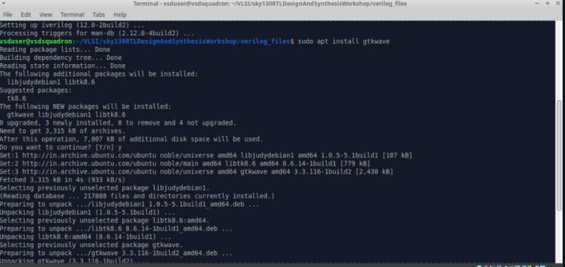

### Simulate the Design: `good_mux`

Follow the steps below to compile, simulate, and view the waveform for the `good_mux` design.

#### 1. Compile the Design and Testbench

```bash
iverilog good_mux.v tb_good_mux.v
```

#### 2. Run the Simulation

```bash
./a.out
```

This will generate a waveform file named `tb_good_mux.vcd`.

#### 3. View the Waveform

```bash
gtkwave tb_good_mux.vcd
```

The verilog code for the design good_mux.v is shown below


The verilog code for the testbench tb_good_mux.v is shown below


results:


viewing the waveform 


---
### SKY130RTL D1SK2 L3 Lab2 Introduction iverilog gtkwave part2
---

### 1. `good_mux.v` (Design)

```verilog
module good_mux (input i0, input i1, input sel, output reg y);

  always @(*) begin
    if (sel)
      y = i1;
    else
      y = i0;
  end

endmodule
```

### Explanation:

* **Inputs**: `i0`, `i1`, and `sel` (all 1-bit signals)
* **Output**: `y` (register type, 1-bit)
* The `always @(*)` block watches all inputs.
* If `sel = 1`, then `y = i1`; else `y = i0`.
* This is a 2:1 multiplexer.

---

## 2.`tb_good_mux.v` (Testbench)

```verilog
`timescale 1ns / 1ps

module tb_good_mux;

  // Inputs
  reg i0, i1, sel;

  // Output
  wire y;

  // Instantiate the Unit Under Test (UUT)
  good_mux uut (
    .i0(i0),
    .i1(i1),
    .sel(sel),
    .y(y)
  );

  initial begin
    $dumpfile("tb_good_mux.vcd");
    $dumpvars(0, tb_good_mux);

    // Initialize Inputs
    sel = 0;
    i0 = 0;
    i1 = 0;

    // Run simulation for 300 ns
    #300 $finish;
  end

  // Toggle sel every 75 ns
  always #75 sel = ~sel;

  // Toggle i0 every 10 ns
  always #10 i0 = ~i0;

  // Toggle i1 every 55 ns
  always #55 i1 = ~i1;

endmodule
```

---

## Testbench Behavior:

* Simulation runs for 300 ns.
* `sel` toggles every 75 ns to switch between `i0` and `i1`.
* `i0` toggles every 10 ns.
* `i1` toggles every 55 ns.
* Output `y` follows `i0` or `i1` based on the value of `sel`.
* Waveform is dumped to `tb_good_mux.vcd` and can be viewed using GTKWave.

---
## Introduction to Yosys and Logic synthesis
---
### SKY130RTL D1SK3 L1 Introduction to yosys
---

## Introduction to Yosys

**Yosys** is the synthesizer tool used in this course. It is responsible for converting RTL (Register Transfer Level) code into a gate-level **netlist** using standard cells.

### Role of Synthesizer:

A synthesizer takes a digital RTL design and a standard cell library (`.lib` file) and generates a netlist that represents the circuit using gates and cells from the library.

### Yosys Synthesis Flow:

1. **Inputs to Yosys**:

   * The RTL design (`.v` file)
   * The standard cell library (`.lib` file)


2. **Yosys Commands**:

   * `read_verilog` – Reads the Verilog design file.
   * `read_liberty` – Reads the `.lib` file containing timing and cell information.
   * `write_verilog` – Writes out the synthesized netlist.


3. **Output**:

   * A netlist file representing the design using standard cells from the `.lib` library.

### Netlist Verification:

To verify if the synthesis process was successful and functionally correct:

* Use the **same testbench** that was used for the original RTL simulation.
* Apply the synthesized **netlist** and the **testbench** to the simulator (**Icarus Verilog**).
* Generate the VCD (`.vcd`) file.
* Load the VCD file in **GTKWave** and compare the waveform output.


### Important Notes:

* The stimulus in the testbench **must match** the one used during RTL simulation.
* The **primary inputs and outputs** of the netlist remain the same as the RTL design.
* Therefore, **the same testbench** can be reused for post-synthesis simulation.


---
### SKY130RTL D1SK3 L2 introduction to logic synthesis part1
---

### **Logic Synthesis Overview**

#### **1. RTL Design**

* RTL (Register Transfer Level) design is the **behavioral representation** of a digital system based on its required specification.
* It defines how data moves between registers and how operations are performed on that data.


#### **2. What is Logic Synthesis?**

* Logic synthesis is the **process of converting RTL code into a digital logic circuit**.
* This involves translating behavioral descriptions into a network of logic gates.
* The transition from RTL to gate-level design is called **synthesis**.
* The final output of this process is a **netlist**, which describes the gates and their interconnections.

#### **3. Inputs and Outputs of Synthesis**

* **Inputs:**

  * RTL Design (written in Verilog or VHDL)
  * Technology Library (`.lib` file)
* **Output:**

  * Gate-level netlist (`.v` file)


#### **4. What is a `.lib` File?**

* A `.lib` file is a **collection of logic cells** provided by a standard cell library.
* It includes basic gates like **AND, OR, NOT**, and their **variants**:

  * Different **input configurations** (e.g., 2-input OR, 3-input OR)
  * Different **speed-power tradeoffs** (e.g., **slow**, **medium**, **fast** cells)


#### **5. Why Different Flavours of Gates?**

* The **combinational delay** in a logic path directly affects the **maximum speed** of a digital circuit.


* The clock cycle must account for:

  ```
  Tclk > Tcq_A + Tcomb + Tsetup_B
  ```

  * **Tcq\_A** = Clock-to-Q delay of DFF A
  * **Tcomb** = Delay of the combinational logic
  * **Tsetup\_B** = Setup time of DFF B

* To **minimize Tcomb**, we use **faster cells** from the `.lib` file.

* This helps reduce the required **clock period (Tclk)** and hence **increase the operating frequency**.

#### **6. Maximum Clock Frequency**

* The **minimum clock period** determines the **maximum frequency**:

  ```
  fclk(max) = 1 / Tclk(min)
  ```


---
### SKY130RTL D1SK3 L3 introduction to logic synthesis part2
---

### **Are Faster Cells Sufficient?**

At first glance, it might seem that using only **faster cells** is the key to achieving **maximum performance**. After all, higher clock speeds typically mean better performance. But this leads us to an important question:

> If faster cells minimize delay, **why are slower cells needed at all?**

---

### **Why Do We Need Slow Cells?**

To meet **timing constraints**, both **setup** and **hold** times must be satisfied:

* For **setup time** (performance constraint), we want the data to arrive *before* the clock edge.
* For **hold time** (reliability constraint), we want the data to **stay stable briefly after** the clock edge.


If the combinational delay is **too short**, we may violate **hold time**:

```
Thold_B < Tcq_A + Tcomb
```

So:

* We need **faster cells** to **reduce Tcomb** and meet setup timing.
* We need **slower cells** to **increase Tcomb** and avoid hold time violations.

The `.lib` file includes all these different **cell variants** to allow flexibility in achieving the correct balance.

---

### **Understanding Hold Time**

* **Hold time** of a flip-flop is the **minimum time** after the clock edge during which data **must remain stable**.
* If the input to flip-flop B changes **too quickly**, it might capture the **wrong data**.
* Thus, **slower cells** can intentionally **increase delay** to help meet the hold constraint.

---

### **Faster vs. Slower Cells**

* The **load** in a digital logic circuit is essentially a **capacitance**.
* The **faster** we can **charge/discharge** this load, the **lower** the propagation delay.

| Parameter        | Faster Cells          | Slower Cells              |
| ---------------- | --------------------- | ------------------------- |
| Transistor Width | Wider (more current)  | Narrower (less current)   |
| Delay            | Lower                 | Higher                    |
| Area             | Larger                | Smaller                   |
| Power            | Higher                | Lower                     |
| Use Case         | Improves setup timing | Helps fix hold violations |

---

### **Trade-Offs: Speed vs. Area/Power**

Faster cells offer performance benefits but come at a **cost**:

* **More area**
* **More power consumption**
* **Greater risk of hold time violations**

Slower cells are:

* **Power-efficient**
* **Area-efficient**
* **Useful in preventing hold violations**

Hence, **faster cells are not always sufficient or ideal**.

---

### **Selection of Cells: Synthesizer Guidance**

The **synthesis tool** decides which cells to use during logic synthesis. However, we must **guide** it to choose an **optimal mix** of fast and slow cells.

* **Too many fast cells** → High power, large area, potential hold issues.
* **Too many slow cells** → Fails to meet timing/performance goals.

This guidance is provided using **constraints**:

* Timing constraints (clock period, setup/hold margin)
* Area and power constraints
* Design objectives and priorities

---

### **Conclusion**

The process of synthesis is not just about making the circuit work—it's about making it work **efficiently**. The selection between faster and slower cells is a **critical design decision**, and synthesis tools use **constraints** to make this trade-off in a balanced way.


---
## Labs using Yosys and Sky130 PDKs
---
### SKY130RTL D1SK4 L1 Lab3 Yosys 1 good mux Part1
---

### **Introduction to Synthesizer: Yosys**

**Yosys** is an open-source synthesis tool used for converting RTL code into a gate-level netlist using a given standard cell library.

#### **Steps to Invoke and Use Yosys**

1. **Start Yosys**

   * Open a terminal and navigate to the working directory:

     ```bash
     cd verilog_files
     ```
   * Invoke the tool by typing:

     ```bash
     yosys
     ```

---

#### **1. Read the Standard Cell Library**

Before synthesis, the tool must understand the available logic cells. This is done by reading the `.lib` file:

```yosys
read_liberty -lib ../lib/sky130_fd_sc_hd__tt_025C_1v80.lib
```

---

#### **2. Read the Verilog Design**

Next, import the RTL design (example: a multiplexer design named `good_mux.v`):

```yosys
read_verilog good_mux.v
```


---

#### **3. Perform Synthesis**

Specify the top module of the design:

```yosys
synth -top good_mux
```


This step translates the RTL to a gate-level representation using generic gates.


---

#### **4. Technology Mapping**

Map the synthesized design to standard cells defined in the `.lib` file:

```yosys
abc -liberty ../lib/sky130_fd_sc_hd__tt_025C_1v80.lib
```


At this stage, the synthesis is complete and the result is a netlist using specific standard cells.

---

#### **5. Analyze the Output**


* Compare the netlist with the original `good_mux.v`.
* **Note:**

  * The output netlist will not include internal signals.
  * Only **3 inputs** and **1 output** are visible (as in the original RTL).
  * The following **standard cells** are used:
mux2_1

---

#### **6. Visualize the Logic**

To view a graphical representation of the synthesized logic, use the `show` command:

```yosys
show
```


This launches a viewer that displays the gate-level circuit as derived from the RTL.


---
### SKY130RTL D1SK4 L2 Lab3 Yosys 1 good mux Part2
--- 

### **Corresponding Verilog Code**

```verilog
module good_mux (
    input i0,
    input i1,
    input sel,
    output reg y
);

always @(*) begin
    if (sel)
        y = i1;
    else
        y = i0;
end

endmodule
```

---

### **Explanation of the Yosys Output Image**

This is a graphical, gate-level representation of the `good_mux` module, generated using the `show` command in Yosys after synthesis and technology mapping using the Sky130 standard cell library.

#### **Block-by-Block Explanation**

| Element                   | Description                                                                      |
| ------------------------- | -------------------------------------------------------------------------------- |
| `i0`, `i1`, `sel`         | These are the 3 input signals to the module, shown entering on the left.         |
| `$86`                     | Internal instance name auto-generated by Yosys.                                  |
| `sky130_fd_sc_hd__mux2_1` | This is the 2:1 multiplexer standard cell from the Sky130 standard cell library. |
| `A0`, `A1`, `S`           | Input pins of the multiplexer: A0 = i0, A1 = i1, S = sel                         |
| `X`                       | Output pin of the multiplexer cell.                                              |
| `y`                       | Final output of the module, connected to the mux output.                         |
| `good_mux`                | Name of the top-level module.                                                    |

---

### **Mapping Between RTL and Synthesized Logic**

* The `always` block in the RTL uses an `if-else` condition to assign either `i0` or `i1` to `y`, based on the value of `sel`.
* During synthesis, Yosys recognized this as a 2:1 multiplexer function.
* It replaced the behavioral logic with a `sky130_fd_sc_hd__mux2_1` standard cell.
* This standard cell has three inputs: A0 (i0), A1 (i1), and S (select), and one output X which drives `y`.

---

### **Conclusion**

Yosys successfully synthesized the behavioral Verilog into a gate-level representation using the appropriate multiplexer cell from the Sky130 library. The visualization shows that the design is mapped efficiently, and internal signals are optimized out in favor of direct cell-level connections.

---
### SKY130RTL D1SK4 L3 Lab3 Yosys 1 good mux Part3
---

### **Writing the Netlist in Yosys**

Once synthesis and technology mapping are complete, you can **export the gate-level netlist** using the following command:

```yosys
write_verilog good_mux_netlist.v
```


This generates a netlist file named `good_mux_netlist.v`.

To create a **simplified netlist** (without attributes like timing, area, etc.), use:

```yosys
write_verilog -noattr good_mux_netlist.v
```

This version is easier to read and focuses only on structural connections.

---


### **Sample Netlist: `good_mux_netlist.v`**

```verilog
module good_mux(i0, i1, sel, y);

  // Wire declarations
  wire n0;
  wire n1;
  wire n2;
  wire n3;

  // Port declarations
  input i0;
  input i1;
  input sel;
  output y;

  // Instance of standard cell mux2_1 from Sky130 library
  sky130_fd_sc_hd__mux2_1 u1 (
    .A0(n0),
    .A1(n1),
    .S(n2),
    .X(n3)
  );

  // Wire assignments
  assign n0 = i0;
  assign n1 = i1;
  assign n2 = sel;
  assign y  = n3;

endmodule
```

---

### **Explanation of Key Elements**

| Component                          | Description                                           |
| ---------------------------------- | ----------------------------------------------------- |
| `sky130_fd_sc_hd__mux2_1`          | 2:1 multiplexer standard cell from the Sky130 library |
| `u1`                               | Instance name (can be autogenerated or user-defined)  |
| `.A0(n0), .A1(n1), .S(n2), .X(n3)` | Port-to-net connections                               |
| `n0–n3`                            | Internal wires for connecting RTL ports to cell ports |

---

### **Notes**

* This netlist is **structural**, meaning it lists the components used and how they’re connected.
* It's used for **place and route**, **static timing analysis**, and further backend steps.
* The simplified netlist with `-noattr` is generally preferred for **manual inspection or debugging**.

---
# Day 2 - Timing libs, hierarchical vs flat synthesis and efficient flop coding styles
---
## Introduction to timing .libs
---
### SKY130RTL D2SK1 L2 Lab4 Introduction to dot Lib part1
---

### **Understanding the Contents of a `.lib` File**

The `.lib` file, also known as a **Liberty file**, contains detailed **timing, power, and functional information** about standard cells used during synthesis. Let’s break down the key elements from a typical `.lib` file.

---


#### **1. Library Declaration**

```
Library ("sky130_fd_sc_hd__tt_025C_1v80")
```

This line defines the **name of the library** being used.

* `sky130_fd_sc_hd`: SkyWater 130nm standard cell library (high-density variant).
* `tt`: Refers to the **PVT (Process-Voltage-Temperature) corner**, in this case, **typical process**.
* `025C`: Indicates a **temperature of 25°C**.
* `1v80`: Indicates the **supply voltage** is **1.80V**.

---

#### **2. What is a PVT Corner?**

PVT stands for **Process, Voltage, and Temperature** — three key variables that influence how silicon behaves.

| Parameter       | Meaning                                                                                                |
| --------------- | ------------------------------------------------------------------------------------------------------ |
| **Process**     | Refers to **fabrication variation** (e.g., fast, slow, typical silicon).                               |
| **Voltage**     | Varying supply voltages affect the switching speed and power.                                          |
| **Temperature** | Higher temperatures cause **slower operation**, and lower temperatures can cause **faster switching**. |

---

#### **3. Why Do We Need PVT Corners?**

Due to real-world variations during manufacturing and operating conditions, we need to ensure that our design:

* Works correctly in **worst-case**, **best-case**, and **typical** conditions.
* Is **functionally correct** and **timing-safe** under **all valid scenarios**.

Examples of PVT corners:

| Corner Name    | Description                                   |
| -------------- | --------------------------------------------- |
| `ss_125C_1v60` | Slow process, 125°C, 1.60V (worst-case delay) |
| `ff_0C_1v95`   | Fast process, 0°C, 1.95V (best-case delay)    |
| `tt_025C_1v80` | Typical case for normal operation             |

---

#### **Conclusion**

The `.lib` file acts as a **technology reference** for the synthesis tool. It helps the tool:

* Select appropriate **standard cells**.
* Estimate **timing** and **power**.
* Perform **technology mapping** based on **PVT-aware constraints**.

A proper understanding of the `.lib` content ensures that the synthesized circuit will function correctly under all expected operating conditions.

---
### SKY130RTL D2SK1 L2 Lab4 Introduction to dot Lib part2
---

### **Deep Dive into the `.lib` File**

The `.lib` (Liberty) file contains **detailed information about standard cells** used during logic synthesis and static timing analysis. Let’s explore its major contents and structure.

---


### **1. Units and Operating Conditions**

The `.lib` file begins by defining **units** for various physical quantities:

* **Time** (e.g., in nanoseconds)
* **Voltage** (e.g., volts)
* **Power** (e.g., microwatts)
* **Current** (e.g., milliamperes)
* **Resistance**, **Capacitance**, **Capacitive load** (typically in ohms, femtofarads, etc.)


It also specifies the **operating conditions** under which the cell data is valid, including:

* **Temperature**
* **Supply voltage**
* **Process corner**

These parameters help the synthesis tool evaluate the performance of each cell under different environmental and manufacturing variations.

---

### **2. Multiple Cells and Cell Definitions**

A typical `.lib` file contains **many standard cells**. Each cell begins with the keyword:

```liberty
cell (cell_name) {
   ...
}
```

For example:

```liberty
cell (sky130_fd_sc_hd__a2111o_1) {
   ...
}
```


This marks the beginning of the definition for the cell `sky130_fd_sc_hd__a2111o_1`.

---

### **3. Flavours of Cells**

* The **same logic function** may have **multiple variants** (or flavours), e.g., `_0`, `_1`, `_2`, etc.
* These variants differ in **driving strength**, **delay**, **power consumption**, and **area**.
* For example:

  * `sky130_fd_sc_hd__a2111o_1`: Standard drive
  * `sky130_fd_sc_hd__a2111o_2`: Higher drive strength

---

### **4. Example Cell: `sky130_fd_sc_hd__a2111o_1`**

* This is a complex gate with **5 inputs**: `A1`, `A2`, `B1`, `C1`, `D1`.

* The cell performs a specific logic operation defined in both `.lib` and equivalent Verilog model.


* You can view the **Verilog model** of the library using:

  ```bash
  :sp ../my_lib/verilog_model/sky130_fd_sc_hd.v
  ```


* Since there are 5 inputs, and each can be 0 or 1:

  * Total possible input combinations = 2⁵ = **32**
  * The `.lib` includes **leakage power** data for **every combination**.


---

### **5. Key Information Inside Each Cell Block**

Each cell definition includes:

| Parameter           | Description                                                              |
| ------------------- | ------------------------------------------------------------------------ |
| `area`              | Physical area of the cell (in square microns)                            |
| `pin`               | Definition block for each input/output port                              |
| `input_capacitance` | Intrinsic capacitance of the input pin                                   |
| `power`             | Power consumption info: internal power, leakage, dynamic                 |
| `timing`            | Delay, transition time, and slope-related timing information             |
| `function`          | Boolean logic function implemented by the cell                           |
| `related_pin`       | Specifies which other pin affects timing of a given pin (for setup/hold) |


---

### **6. Importance in Synthesis and Timing**

The data in the `.lib` file helps the synthesis tool:

* Estimate **propagation delays**
* Analyze **power** and **leakage**
* Select the **most optimal variant** of a cell based on constraints
* Ensure that designs meet **setup**, **hold**, and **clock period** requirements

---
### SKY130RTL D2SK1 L2 Lab4 Introduction to dot Lib part3
---
Here is a structured explanation for **Example 2** on analyzing a smaller gate (AND gate) from the standard cell library. This version is formatted cleanly for use in reports, lab manuals, or documentation:

---

### **Example 2: Understanding a Simple Gate – AND Gate**


#### **Cell Under Study: `sky130_fd_sc_hd__and2_0`**


This is a **2-input AND gate** from the Sky130 standard cell library.

* **Name**: `sky130_fd_sc_hd__and2_0`
* **Function**: Performs logical AND on two inputs
* **Inputs**: A, B
* **Output**: Y
* **Input Combinations**: Since it has 2 inputs, total possible combinations = 2² = **4**

---

### **Verilog Model**

The behavior of this cell can be viewed by opening the Verilog model file:

```bash
:sp ../my_lib/verilog_model/sky130_fd_sc_hd.v
```


In the Verilog model, you’ll find something like:


---
### **Area Analysis**

To compare the area of two AND gate variants (`and2_0` vs `and2_1`), open the `.lib` file and locate the corresponding `cell` blocks.

> **Note:**
> To split the GVim window vertically for side-by-side viewing, use the command:
>
> ```
> :vsp
> ```
>
> This is useful for comparing two cells (e.g., `and2_0` and `and2_1`) in the same `.lib` file.


Inside the `.lib` file (`sky130_fd_sc_hd__tt_025C_1v80.lib`), search for:

```liberty
cell (sky130_fd_sc_hd__and2_0) {
    area : <value>;
    ...
}

cell (sky130_fd_sc_hd__and2_1) {
    area : <larger value>;
    ...
}
```


This shows that:

* `and2_1` has a **larger area** than `and2_0`.
* The larger area implies **wider transistors** are used in `and2_1`.
* **Wider transistors** can **source/sink more current**, leading to **faster switching**, but they occupy more silicon area and consume more power.

#### **Comparison: `and2_0` vs `and2_1`**

| Cell Name                 | Area (μm²) | Inference                    |
| ------------------------- | ---------- | ---------------------------- |
| `sky130_fd_sc_hd__and2_0` | Smaller    | Narrower transistors, slower |
| `sky130_fd_sc_hd__and2_1` | Larger     | Wider transistors, faster    |

This implies:

* **Higher drive strength versions** (like `_1`, `_2`) use **wider transistors**.
* Wider transistors can **charge/discharge load capacitance faster**, resulting in **lower delay**.
* However, they **consume more area** and often more **power**.

---

### **Conclusion**

By comparing `and2_0` and `and2_1` in the `.lib` file:

* You observe the **trade-off between area and performance**.
* Larger cells = **faster**, but **costlier** in silicon area.
* Synthesis tools must choose the **right variant** based on timing, area, and power constraints.

---
## Hierarchical vs Flat Synthesis
---
### SKY130RTL D2SK2 L1 Lab05 Hier synthesis flat synthesis part1
---
### **What is Hierarchical vs. Flat Synthesis?**

In digital design, a system can be built using **multiple submodules**. The way these are handled during synthesis can follow either a **hierarchical** or **flat** approach.

#### **Hierarchical Synthesis**

* In **hierarchical synthesis**, the **submodules are preserved** as independent entities during synthesis.
* Each module is synthesized separately, and then connected at the top level.
* **Benefits**:

  * Faster synthesis for large designs
  * Useful for modular debugging and reuse
* **Drawbacks**:

  * Limited global optimization across module boundaries

#### **Flat Synthesis**

* In **flat synthesis**, all submodules are **inlined into the top-level module**, forming a single flattened netlist.
* This allows the synthesizer to perform **global optimizations**.
* **Benefits**:

  * Better optimization for area, timing, and power
* **Drawbacks**:

  * More memory and time-consuming
  * Harder to trace logic back to original modules

---

### **Example Design: `multiple_modules.v`**

This file is located in the `verilog_files` directory and defines a small hierarchical design using two submodules.

#### **Code**


```verilog
// OR gate module
module sub_module2 (input a, input b, output y);
  assign y = a | b;
endmodule

// AND gate module
module sub_module1 (input a, input b, output y);
  assign y = a & b;
endmodule

// Top-level module using two submodules
module multiple_modules (input a, input b, input c, output y);
  wire net1;

  sub_module1 u1 (.a(a), .b(b), .y(net1));  // net1 = a & b
  sub_module2 u2 (.a(net1), .b(c), .y(y));  // y = net1 | c => y = (a & b) | c

endmodule
```


### **Synthesis of `multiple_modules.v`**

Let’s now synthesize the `multiple_modules.v` file.


This design includes two submodules:

* `sub_module1` implements an **AND** gate
* `sub_module2` implements an **OR** gate

The top-level module, `multiple_modules`, instantiates:

* One instance of `sub_module1` (named `u1`)
* One instance of `sub_module2` (named `u2`)

The report shows:

* `sub_module1` contains **one AND gate**
* `sub_module2` contains **one OR gate**
* The top module contains **one instance of each submodule**

Overall, the entire design consists of:

* **One AND gate**
* **One OR gate**

Now, Linkimg the design to the library
In Yosys, this is done using the following command:

```yosys
abc -liberty ../lib/sky130_fd_sc_hd__tt_025C_1v80.lib
```


### **Visualizing the Synthesized Design: Hierarchical View**

After synthesis and linking, use the following Yosys command to view the synthesized logic:

```yosys
show multiple_modules
```


This command opens a graphical representation of the design.

---

### **What Do You See?**


Instead of seeing a logic-level **block diagram** composed of **AND** and **OR** gates, the view shows two **instantiations**:

* `u1`: Instance of `sub_module1`
* `u2`: Instance of `sub_module2`

These are preserved **as separate blocks**, not broken down into their internal logic (AND/OR).

---

### **Why Does This Happen?**

This is an example of a **hierarchical design**.

* The synthesis has preserved the **module hierarchy**.
* The submodules (`sub_module1` and `sub_module2`) are shown as **black boxes** or **instances** inside the top module.
* You don’t see the gates (like AND, OR) because they are **inside the submodules**, and those were **not flattened**.

---

### **What We Expected vs. What We See**

| Expectation                     | Observation                       |
| ------------------------------- | --------------------------------- |
| AND and OR gates shown directly | Only u1 and u2 instances visible  |
| Flat gate-level logic diagram   | Hierarchical module-level diagram |

This highlights the **difference between flat and hierarchical synthesis**.

* **Flat synthesis**: Would have shown individual AND and OR gates.
* **Hierarchical synthesis**: Keeps module boundaries intact, and shows only instances like `u1` and `u2`.

### **Writing the Netlist**

Now let’s write the netlist using the following command:

```yosys
write_verilog -noattr multiple_modules_hier.v
```


This generates a netlist file named `multiple_modules_hier.v` without additional attributes.


When you open the file, you’ll observe that `sub_module1` and `sub_module2` are preserved as **separate modules** in the netlist.


### **Observation from the Generated Netlist**

When the netlist was generated by the instructor, the structure of `sub_module2` appeared different from a straightforward OR gate implementation. It resembled something like the following:


Instead of directly using an **OR gate**, the synthesis tool generated logic using **inverters and a NAND gate**, effectively implementing a **bubbled NAND** (DeMorgan equivalent of an OR gate).

### **Why Did the Synthesis Tool Do This?**

The tool chose this structure not by accident, but as an **optimization based on CMOS design principles**.

#### **CMOS Gate Implementation Basics:**

* **NAND gates** are implemented using **stacked NMOS transistors**, which switch faster and consume less area.
* **NOR gates** are implemented using **stacked PMOS transistors**, which are **slower** and **larger** due to the **poor mobility of holes in PMOS**.

#### **Key Reason:**

> **PMOS transistors have lower mobility than NMOS**, so a stack of PMOS (as in a NOR gate) results in **larger area and slower switching**.

To avoid this:

* The synthesis tool avoids direct NOR gates
* Instead, it may use **NAND + Inverters** (i.e., a bubbled NAND structure) to implement the same logic function **more efficiently** in silicon.

### **Conclusion**

Even though the RTL defines `sub_module2` as an OR gate:

```verilog
assign y = a | b;
```

The synthesis tool rewrites this into a form better suited for CMOS implementation — one that:

* Uses **fewer or smaller PMOS transistors**
* Is **faster and more area-efficient**
* Maintains the exact same logical behavior

This is a common optimization done automatically by the synthesis engine during technology mapping.
---
### SKY130RTL D2SK2 L2 Lab05 Hier synthesis flat synthesis part2
---
### **Synthesis Behavior**

* If you synthesize this design **hierarchically**, `sub_module1` and `sub_module2` will appear as **separate blocks** in the netlist.
* If you synthesize it **flat**, the synthesis tool will **merge** all logic into the `multiple_modules` block and eliminate submodule boundaries.

### **Flattening the Design**

To flatten the design and remove module hierarchies, use the following command in Yosys:

```yosys
flatten
write_verilog -noattr multiple_modules_flat.v
```


This generates a **flattened netlist** named `multiple_modules_flat.v`.

---

### **Comparison with Hierarchical Netlist**


* In the **hierarchical netlist**, the definitions of `sub_module1` and `sub_module2` are **preserved as separate modules**.
* In the **flattened netlist**, the **hierarchy is removed**.

  * The logic inside the submodules is **inlined** into the top-level module.
  * You directly see the **AND** and **OR** gate instantiations within `multiple_modules`.

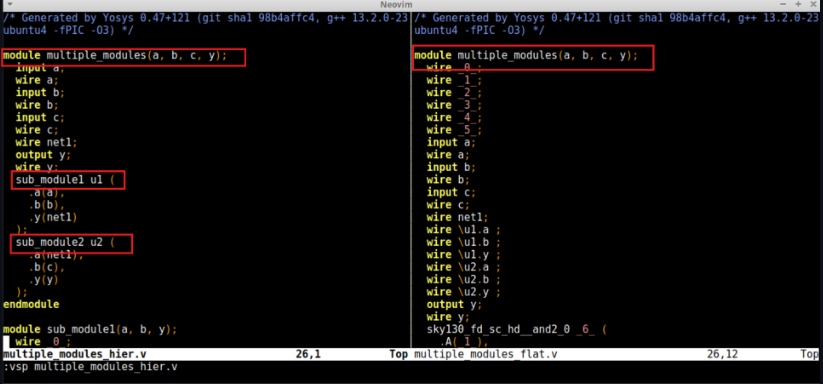


use command show to see the graphyical representation

```yosys
show
```


---

### **Conclusion**

Flattening simplifies the structure for downstream tools and allows better optimization, but it also removes modular boundaries, making the design harder to interpret manually.

---

### **Submodule-Level Synthesis**

Let’s now perform **synthesis at the submodule level**, taking `sub_module1` (instance `u1`) as an example.

#### **Yosys Commands:**

```yosys
read_liberty ../lib/sky130_fd_sc_hd__tt_025C_1v80.lib
read_verilog multiple_modules.v
synth -top sub_module1
abc -liberty ../lib/sky130_fd_sc_hd__tt_025C_1v80.lib
show
```


---

### **What Do We See?**

Since we’ve explicitly specified `sub_module1` as the top module, Yosys synthesizes **only this module**, which is a simple **AND gate**.

* The visualization (`show`) displays just the **AND gate logic**.
* You will **not see `sub_module2`** or the top-level module `multiple_modules`.

---

### **Why Perform Submodule-Level Synthesis?**

Submodule-level synthesis is useful in several scenarios:

#### **1. Reuse of Repeated Logic**

* Consider a design where the top-level module contains **six instances of a multiplier**.
* Instead of synthesizing the multiplier logic **six times**, we can:

  * Synthesize the multiplier module **once**
  * **Reuse** that synthesized instance multiple times in the top module
* This improves **efficiency**, **reduces redundancy**, and saves **time and resources**.

#### **2. Divide and Conquer Approach**

* For **large or complex designs**, it's more practical to:

  * Synthesize individual submodules independently
  * Then integrate them into the full system
* This approach is scalable and simplifies **debugging**, **timing analysis**, and **modular development**.

---

### **Conclusion**

Submodule-level synthesis allows:

* **Efficient handling** of repeated instances
* Easier **modular design and optimization**
* A scalable method for managing **large-scale digital systems**

---
##
---
###
---

### **Given:**

Expression:

```
Y = (A & B) | C
```

### **Gate Delays:**

* AND gate = **2 ns**
* OR gate = **1 ns**

---

### **Input Transitions at t = 0 ns:**

| Signal | Transition    |
| ------ | ------------- |
| A      | 0 → 1 at 0 ns |
| B      | 0 → 1 at 0 ns |
| C      | 1 → 0 at 0 ns |

---

### **Initial Values (before 0 ns):**

* A = 0
* B = 0
* C = 1
  → (A & B) = 0
  → Y = 0 | 1 = **1**

Now let’s analyze what happens **after time = 0 ns**.

---

### **Step-by-Step Timing:**

#### **Time = 0 ns**

* A and B start transitioning from 0 → 1
* C starts transitioning from 1 → 0

#### **Time = 1 ns**

* OR gate sees C = 0
  → It sees (A & B) = **still 0** (AND hasn't produced output yet — 2 ns delay)
  → OR gate evaluates: `0 | 0 = 0`
  → **Y falls to 0** → **glitch**

#### **Time = 2 ns**

* AND gate output becomes 1 (A=1, B=1)
* OR gate sees: `1 | 0 = 1`
  → Y returns to 1

---

### **Waveform**


---

### **Conclusion:**

* Y was initially **1**
* Due to all signals changing simultaneously, the OR gate **briefly saw both inputs as 0** at 1 ns:

  * AND gate hadn't responded yet
  * C had already dropped to 0
* So **Y glitched** to 0, then returned to 1 after AND gate output arrived
* This is a **Static-1 hazard**, caused by **unbalanced path delays**

---

### **Why We Need a Flip-Flop in Digital Circuits**

In a **purely combinational circuit**, outputs respond directly to input changes — including glitches caused by signal delays. If there is no mechanism to control when outputs are sampled or updated, **glitches may propagate continuously**, preventing the output from ever settling. This is undesirable, especially in sequential digital systems.

---

### **Role of Flip-Flops**

To solve this problem, we introduce a **flip-flop** (typically a **D flip-flop**) — a **storage element** used to:

* **Capture and hold** the output of a combinational block
* **Restrict glitches** from propagating endlessly
* **Synchronize signal transitions** using a **clock edge**

The **D flip-flop updates its output only at a specific clock edge** (usually rising or falling), so:

* Even if the combinational logic is glitchy in between, the flip-flop **ignores** those changes
* It passes **only the final, stable value** to the next stage
* Thus, each stage in the circuit receives **stable inputs**, allowing the system to function reliably

---

### **Why Initialization Is Important**

If the **initial state** of a flip-flop is unknown (i.e., not set or reset), the output of the combinational logic **may evaluate incorrectly**, producing garbage values.

To avoid this:

* We **initialize** the flip-flop using a **reset** or **set** signal during startup
* This ensures the system starts from a **known, predictable state**

---
SKY130RTL D2SK3 L2 Why Flops and Flop coding styles part2
---


---
### SKY130RTL D2SK3 L3 Lab flop synthesis simulations part1
---
Now lets simulate the following flops 
1) D FlipFlop with Asynchronous reset
2) D FlipFlop with Synchronous reset
3) D FlipFlop with Synchronous and Asynchronous reset
4) D FlipFlop with Asynchronous set

**1) D FlipFlop with Asynchronous reset**


Zoomed out waveform


Zooming at the point when reset changes from low to high


**2) D FlipFlop with Synchronous reset**


**3) D FlipFlop with Synchronous and Asynchronous reset**


**4) D FlipFlop with Asynchronous set**


---
### SKY130RTL D2SK3 L4 Lab flop synthesis simulations part2
---
Now let's synthesize the following D flipflops
1) D FlipFlop with Asynchronous reset
2) D FlipFlop with Synchronous reset
3) D FlipFlop with Synchronous and Asynchronous reset
4) D FlipFlop with Asynchronous set

### **1) D FlipFlop with Asynchronous reset**

**Why We Use `dfflibmap` in Synthesis Flow**

When performing logic synthesis using tools like **Yosys**, we typically use a standard cell library (`.lib` file) that contains both **combinational** and **sequential** cells (like D flip-flops). However, in many design flows, **flip-flops are provided in a separate library** from the main logic gates.

To handle this, we use the Yosys command:

```bash
dfflibmap -liberty ../lib/your_flipflop_library.lib
```

---
**What `dfflibmap` Does**

* It maps generic D flip-flop constructs (like `always @(posedge clk)` in RTL) to **specific standard cells** in the library.
* This is essential for **correct technology mapping** — otherwise, the tool may not know which flip-flop cell to use.
* It ensures **timing-aware synthesis** using the correct sequential elements.

---
**Typical Flow Including `dfflibmap`**

```bash
read_liberty -lib ../lib/sky130_fd_sc_hd__tt_025C_1v80.lib
read_verilog design.v
synth -top <top_module>
dfflibmap -liberty ../lib/sky130_fd_sc_hd__tt_025C_1v80.lib
abc -liberty ../lib/sky130_fd_sc_hd__tt_025C_1v80.lib
```


**Why the Tool Inserted an Inverter**

In the Verilog code, the D flip-flop is written with an **active-high reset** condition:

```verilog
if (reset)
    q <= 0;
```

However, the standard cell library may only contain **flip-flops with active-low reset** functionality.

To resolve this mismatch, the synthesis tool automatically inserts an **inverter** in front of the reset signal. This converts the active-high reset logic used in the RTL to match the **active-low reset behavior** expected by the physical flip-flop cell in the library.

---

**Why `dfflibmap` is Important**

* Without `dfflibmap`, the flip-flop may **not be mapped** correctly to a physical cell.
* This can result in either:

  * **Synthesis failure**
  * Or an **incomplete netlist** (no physical representation for your DFF)

---

### **2) D FlipFlop with Synchronous reset**


### **3) D FlipFlop with Synchronous and Asynchronous reset**

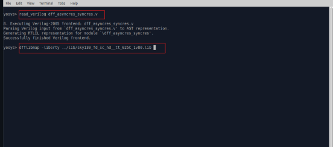


### **4) D FlipFlop with Asynchronous set**


---
### SKY130RTL D2SK3 L5 Interesting optimisations part1
---
### **Optimization Insight: Multiplication by Constant Power of 2**

We are examining an important optimization that synthesis tools automatically apply.

We will consider two Verilog RTL files: `mul2.v` and `mul8.v`. Open them together using:

```
gvim mul*.v -o
```

---

### **`mul2.v` – Multiply by 2**

```verilog
module mul2 (input [2:0] a, output [3:0] y);
    assign y = a * 2;
endmodule
```


This module multiplies a 3-bit input `a` by 2 and gives a 4-bit output `y`.

---

### **Optimization Insight**

At first glance, the multiplication operator (`*`) may suggest the need for a **hardware multiplier**. However, multiplying by 2 (or any power of 2) is simply a **bitwise left shift**(Hence after synthesizing the top module you will see that there are 0 cells inferred)

Example:

* $5 \times 4 = 20$
* $0101 \times 4 = 10100$ → This is just **shifting left by 2 bits**

Hence:

* Multiplication by 2 = shift left by 1 bit
* Multiplication by 4 = shift left by 2 bits
* Multiplication by $2^n$ = shift left by $n$ bits

---

### **Effect of Synthesis on `mul2`**

When we synthesize this module, the synthesis tool recognizes that:

```verilog
y = a * 2;
```

is equivalent to:

```verilog
y = a << 1;
```


So instead of generating a multiplier, the tool simply wires the bits accordingly — **no actual multiplier hardware is required**.

This is a classic **strength reduction optimization** applied during synthesis.

---
### SKY130RTL D2SK3 L6 Interesting optimisations part2
---
### **Special case: Optimizing `y = a * 9` for `a[2:0]`**

We are considering the case:

```verilog
input  [2:0] a;
output [5:0] y;

assign y = a * 9;
```

---

### **Understanding the Multiplier**

Multiplying by 9 can be decomposed into a shift and add:

```
9 = 8 + 1 = (1 << 3) + 1
```

So:

```
a * 9 = (a << 3) + a
```

This means:

* `a << 3` is equivalent to appending **three 0s** at the right → forms `{a, 000}`
* Adding back `a` aligns it at LSB
* The total effect is **replicating `a` twice** in adjacent positions

---

### **Binary Form View**

Let `a = 3'babc`

* `a << 3` = `{a, 000}`
* Adding `a` to that gives: `{a, a}` → bits of `a` repeated

So:

```verilog
y = (a << 3) + a = {a, a} = {aa}
```

---

### **Conclusion**

Multiplying a 3-bit input `a` by 9 is equivalent to:

```
y = {a, a}
```

This optimization avoids the multiplier entirely by using a shift and add structure, and the result is simply **concatenating `a` with itself**.

**NOTE: only the name of the .v file is mul8 but its multiplying with 9**


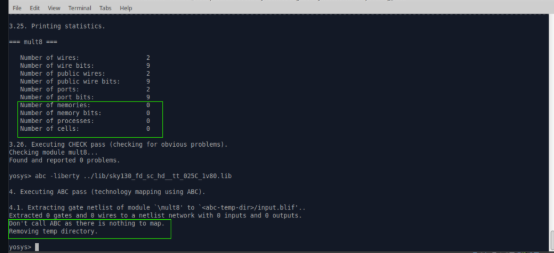


---
# Day 3 - Combinational and sequential optimizations
---
## Introduction to optimizations
---
### SKY130RTL D3SK1 L1 Introduction to optimisations part1
---

### **Combinational Logic Optimization**

The goal of combinational logic optimization is to simplify logic circuits to reduce **area**, **power**, and sometimes **delay**, without altering the functionality of the design.

Optimized logic is essential for efficient hardware implementation.

### **Key Techniques for Optimization**

#### **1. Constant Propagation (Direct Optimization)**

If a signal is driven by a constant value (0 or 1), parts of the logic can be simplified at compile time.
``
assign y = a & 1'b0;  // optimized to y = 0
assign z = b | 1'b1;  // optimized to z = 1
``


#### **2. Boolean Logic Optimization**

This involves algebraic simplification of logic expressions using Boolean identities.

Two major techniques:

##### a) **Karnaugh Map (K-Map)**

* Visual method used for manual simplification of Boolean expressions (typically for up to 4 or 5 variables).
* Identifies common groups (1s) in a truth table to reduce logic expressions.

##### b) **Quine–McCluskey Method**

* Tabular algorithmic approach to minimize Boolean functions.
* Suitable for automation and systematic minimization.
* Handles more variables than K-map and provides a deterministic minimal form.


---

### **Conclusion**

Optimizing combinational logic reduces hardware cost and improves power efficiency. Techniques like **constant propagation**, **K-map**, and **Quine–McCluskey** are fundamental to achieving these improvements during synthesis.

---
### SKY130RTL D3SK1 L2 Introduction to optimisations part2
---
and
---
### SKY130RTL D3SK1 L3 Introduction to optimisations part3
---

### **Sequential Logic Optimization**

Sequential logic optimization targets designs that include **flip-flops, latches, and state machines**. The objective is to reduce **area**, **power**, or **improve timing** while maintaining the same sequential behavior.

---

### **Types of Sequential Logic Optimization**

#### **1. Basic Optimization**

* **Sequential Constant Propagation**
  Similar to constant propagation in combinational logic but applied across clocked elements.
  If a flip-flop is fed by a constant or becomes constant due to logic conditions, it and related logic may be eliminated.


Y=1 always irrespective of clock or reset and this is because of sequential constant propagation  so effectively we do t need any of these gates
---

#### **2. Advanced Optimizations** *(Not covered in lab)*

* **State Optimization**
  Minimizing the number of states or encoding them more efficiently in a finite state machine (FSM).
  For example, using Gray code or one-hot encoding to reduce switching activity or logic size.

* **Retiming**
  Moving flip-flops across combinational logic boundaries without changing functionality to balance path delays.
  Helps in meeting timing constraints by redistributing the pipeline stages.

* **Sequential Logic Cloning (Floorplan-Aware Synthesis)**
  Duplicating certain sequential elements to reduce routing congestion or balance timing across regions of a chip.
  Typically applied during physical-aware synthesis when layout information is available.

---

### **Conclusion**

Sequential logic optimization helps improve timing, reduce area, and minimize power consumption. While basic techniques like **sequential constant propagation** are performed early in synthesis, **advanced methods** such as **retiming** and **FSM state optimization** are used in high-performance, layout-aware flows.

---
## Combinational logic optimizations
---
### SKY130RTL D3SK2 L1 Lab06 Combinational Logic Optimisations part1
---
and
---
### SKY130RTL D3SK2 L2 Lab06 Combinational Logic Optimisations part2
---

We will be using the following files for our lab based on optimization.


The verilog codes for the above modules is shown in the image below


Trying to understand the optimization of the above verilog codes


Now, Synthesizing the above 

### **1) opt_check.v**


### **2) opt_check2.v**


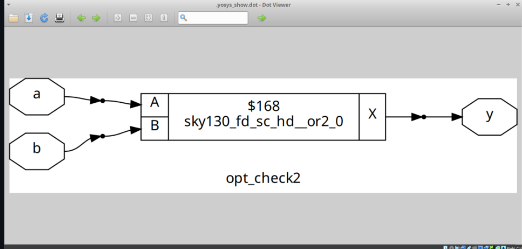

### **3) opt_check3.v**

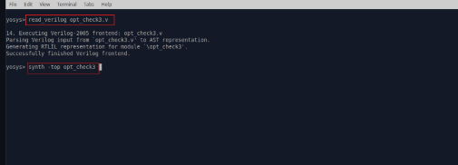


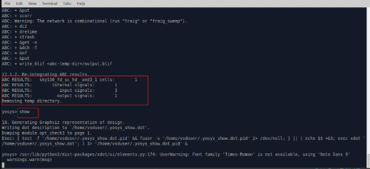


### **4) opt_check4.v**


### **5) multiple_module_opt.v**


### **6) multiple_module_opt2.v**


---
## Sequential logic optimizations
---
### SKY130RTL D3SK3 L1 Lab07 Sequential Logic Optimisations part1
---
we will be working on the following verilog codes


### **1) dff_const1.v and dff_const2.v**

The image below shows the verilog codes


## Module 1: `dff_const`

```verilog
module dff_const1 (
    input clk,
    input reset,
    output reg q
);

always @(posedge clk or posedge reset) begin
    if (reset)
        q <= 1'b0;
    else
        q <= 1'b1;
end

endmodule
```

### What it describes:

* An asynchronous reset D flip-flop:

  * When `reset` is high: `q` is set to `0` immediately.
  * When `reset` is low: on the rising edge of `clk`, `q` is set to `1`.

### Why this infers a flip-flop:

* `q` changes only on the rising edge of the clock or when reset is applied.
* It requires state storage: `q` holds its value between clock cycles.
* Therefore, synthesis infers a D flip-flop with asynchronous reset.

---

## Module 2: `dff_const2`

```verilog
module dff_const2 (
    input clk,
    input reset,
    output reg q
);

always @(posedge clk or posedge reset) begin
    if (reset)
        q <= 1'b1;
    else
        q <= 1'b1;
end

endmodule
```

### What it describes:

* Regardless of whether reset is high or not, and regardless of clock, `q` is always set to `1`.

### Why this does not infer a flip-flop:

* `q` is never functionally dependent on `clk` or `reset`. It is always assigned the constant value `1`.
* The synthesis tool detects that the output is fixed and will optimize it as:

  ```verilog
  assign q = 1'b1;
  ```
* Since there's no dynamic or conditional behavior, no memory element (flip-flop) is required.

---

## Comparison Summary

| Feature          | `dff_const1`              | `dff_const2`                  |
| ---------------- | ------------------------ | ----------------------------- |
| Depends on clock | Yes                      | No (value is always 1)        |
| Output changes   | Yes (based on clk/reset) | No (always 1)                 |
| Storage required | Yes (flip-flop needed)   | No (constant logic only)      |
| Synthesis result | D flip-flop inferred     | Constant logic (no flip-flop) |

---

## Final Verdict

* `dff_const` infers a D flip-flop because the output `q` depends on control signals and stores state.
* `dff_const2` does not infer a flip-flop because the output is constant and requires no sequential behavior. The synthesis tool will optimize it into a simple wire driving logic high.


Now let's verify simulating and also synthesize the modules:

### **1) Simulation of dff_const1 and dff_const2**


### **1) Synthesis of dff_const and dff_const2**


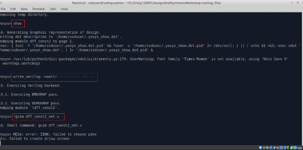


---
### SKY130RTL D3SK3 L2 Lab07 Sequential Logic Optimisations part2
---
and
---
### SKY130RTL D3SK3 L3 Lab07 Sequential Logic Optimisations part3
---


Let's analyze the Verilog code carefully and explain **why this infers two D flip-flops**, even though `q1` appears to take on a constant value.

---

### **Given Module:**

```verilog
module dff_const3 (
    input clk,
    input reset,
    output reg q
);

reg q1;

always @(posedge clk or posedge reset) begin
    if (reset) begin
        q  <= 1'b1;
        q1 <= 1'b0;
    end else begin
        q1 <= 1'b1;
        q  <= q1;
    end
end

endmodule
```


---

### **Line-by-line Behavior**

#### When `reset` is high:

* `q` is set to `1`
* `q1` is set to `0`

#### On rising edge of `clk` (if reset is low):

* `q1` is set to `1`
* `q` is assigned the value of `q1` **from the previous clock cycle** (because assignments in non-blocking (`<=`) style happen in parallel and are registered only at the end of the block).

---

### **Key Insight:**

Although `q1` is **assigned a constant `1'b1` every cycle**, **`q` depends on the value of `q1`** from the **previous clock cycle**:

```verilog
q <= q1;
```

That means:

* `q1` must **hold** its value between clock cycles.
* `q` must **read** that held value.
* Hence, both `q1` and `q` **require state**.

---

### **Why Two Flip-Flops Are Inferred**

Even though `q1` is always set to `1'b1` in the `else` block:

* `q1` is still **used as a register** (i.e., its value is needed across cycles for `q <= q1;`)
* This means it **cannot** be replaced by a constant logic high (`1'b1`) during synthesis.
* The tool **cannot optimize `q1` away** because its **past value is used** (delayed assignment behavior).

So:

* `q1` → needs a flip-flop to store `1` across cycles.
* `q` → also needs a flip-flop, since it depends on `q1`.

---

### **Conclusion**

Even though `q1` is assigned a constant value (`1'b1`), the fact that `q <= q1;` creates a **sequential dependency** on `q1`’s previous value. Therefore:

* The tool **cannot propagate the constant** through `q1`
* It **infers two flip-flops**: one for `q1`, one for `q`

This is a classic case where **sequential constant propagation fails** due to **temporal dependency**.

### **Simulation of the module dff_const3**


### **Synthesizing the module dff_const3**


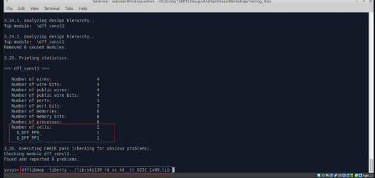


### **4) dff_const4**


### Module: `dff_const4`

```verilog
module dff_const4 (
    input clk,
    input reset,
    output reg q
);

reg q1;

always @(posedge clk or posedge reset) begin
    if (reset) begin
        q  <= 1'b1;
        q1 <= 1'b1;
    end else begin
        q1 <= 1'b1;
        q  <= q1;
    end
end

endmodule
```

---

### Behavioral Analysis

#### During reset:

* `q1` is set to `1'b1`
* `q` is set to `1'b1`

#### On every clock edge:

* `q1` is again assigned `1'b1`
* `q` is assigned the value of `q1`

Now observe the following:

* `q1` is **always** set to `1'b1`, regardless of reset or clock.
* `q` is set to `q1`, which is **always** `1'b1`.

So in functional terms, the entire block is just forcing both `q` and `q1` to be `1'b1` at all times.

---

### Synthesis Tool Perspective

* The synthesis tool recognizes that `q1` is assigned a constant `1'b1` in all cases.
* It replaces all usage of `q1` with `1'b1`.
* Then `q <= q1` becomes `q <= 1'b1`, which is also constant.

Since neither `q` nor `q1` depends on prior values or time-varying logic, **no memory elements** (flip-flops) are needed. The tool will optimize both out and directly tie `q` to logic high.

---

### Conclusion

* `q1` is a **sequential constant**, always `1'b1`.
* `q` is also set to that same constant value.
* There is **no true state-holding behavior**.
* Therefore, **no D flip-flops are inferred**.

The synthesis tool will reduce the entire design to something like:

```verilog
assign q = 1'b1;
```

---

### Summary Table

| Signal | Assignment        | Varies with Time? | Needs Flip-Flop? | Reason                      |
| ------ | ----------------- | ----------------- | ---------------- | --------------------------- |
| `q1`   | Always `1'b1`     | No                | No               | Constant value              |
| `q`    | Assigned `q1` (1) | No                | No               | Also constant after folding |

This module is fully optimized to a constant logic high, and **no sequential logic** remains after synthesis.

### **Simulation of the module dff_const4**


### **Synthesizing the module dff_const4**


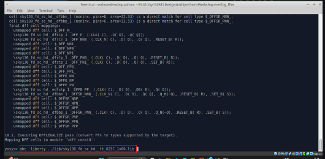


### **5) dff_const5**


### Verilog Module: `dff_const`

```verilog
module dff_const (
    input clk,
    input reset,
    output reg q
);

reg q1;

always @(posedge clk or posedge reset) begin
    if (reset) begin
        q  <= 1'b0;
        q1 <= 1'b0;
    end else begin
        q1 <= 1'b1;
        q  <= q1;
    end
end

endmodule
```

---

### Understanding the Behavior

#### During `reset`:

* `q1` is assigned `0`
* `q` is assigned `0`

#### During normal clocked operation (`reset == 0`):

* `q1` is assigned `1`
* `q` is assigned the **previous value** of `q1`

This is the key:
Due to **non-blocking assignments (`<=`)**, the assignment `q <= q1;` uses the value of `q1` **from the previous clock cycle**, not the new value being assigned in the same block.

---

### Why Two D Flip-Flops Are Inferred

Even though `q1` always eventually holds `1`, the tool **cannot optimize it away** because:

* `q` depends on the **prior value** of `q1`
* This is a classic case of **sequential dependency**

Thus:

* `q1` must be a flip-flop (to hold its value from cycle to cycle)
* `q` must be another flip-flop (to store that delayed value)

---

### Summary Table

| Signal | Behavior                | Flip-Flop Needed | Reason                            |
| ------ | ----------------------- | ---------------- | --------------------------------- |
| `q1`   | 0 on reset, then 1      | Yes              | Must hold value across cycles     |
| `q`    | Delayed version of `q1` | Yes              | Depends on previous value of `q1` |

---

### Final Conclusion

Yes, this module **infers two D flip-flops**:

1. One for `q1` (holding a value that becomes constant after reset but is still sequential)
2. One for `q` (dependent on the value of `q1` from the previous clock cycle)

The synthesis tool **cannot collapse `q1` into a constant**, because it's part of a chain of sequential logic.

### **Simulation of the module dff_const5**


### **Synthesizing the module dff_const5**


---
## Sequential optimzations for unused outputs
---
### SKY130RTL D3SK4 L1 Seq optimisation unused outputs part1
---


### **Verilog Code: `counter_opt`**

```verilog
module counter_opt (
    input clk,
    input reset,
    output q
);

reg [2:0] count;
assign q = count[0];

always @(posedge clk or posedge reset) begin
    if (reset)
        count <= 3'b000;
    else
        count <= count + 1;
end

endmodule
```

---

### **What the Code Does**

* This is a **3-bit up counter**.
* Internally, it increments `count` on every clock cycle.
* However, **only `count[0]`** is exposed as the output (`q`).
* The other two bits `count[1]` and `count[2]` are **never used** in any computation or output.

---

### **Synthesis Tool Behavior**

* The synthesis tool performs **optimization** based on what parts of the logic contribute to the **primary outputs**.
* Since `count[1]` and `count[2]` are **not used**:

  * They do **not affect any observable behavior**.
  * So the tool will **remove the logic** related to them.
* As a result, the tool infers:

  * **Only one D flip-flop**, for `count[0]`
  * The remaining two flip-flops are **optimized out**

---

### **Key Principle:**

> **Any internal logic or signal that does not influence a primary output or observable side-effect will be eliminated during synthesis.**

This is called **unused logic optimization** or **dead code elimination**.

---

### **Conclusion**

Even though the RTL describes a 3-bit counter, the synthesis tool:

* Recognizes that only `count[0]` contributes to the output.
* Eliminates `count[1]` and `count[2]`.
* Implements **only a 1-bit counter** with a **single flip-flop**.

This demonstrates how synthesis tools perform **output-driven optimization**, and reinforces why **unused logic should be avoided in real designs** unless intentionally preserved through constraints.


If assign q= (count[2:0] == 3'100)


```verilog
q = (count[2:0] == 3'b100);
```

**forces all 3 D flip-flops to be inferred**, using synthesis reasoning.

---

### **Updated Code**

```verilog
module counter_opt (
    input clk,
    input reset,
    output q
);

reg [2:0] count;
assign q = (count == 3'b100);

always @(posedge clk or posedge reset) begin
    if (reset)
        count <= 3'b000;
    else
        count <= count + 1;
end

endmodule
```

---

### **What Changed?**

In this version:

* The output `q` is no longer just `count[0]`.
* Instead, it is a **combinational comparison** of the entire 3-bit `count` value with `3'b100`.
* So now, `q` depends on **all three bits**: `count[0]`, `count[1]`, and `count[2]`.

---

### **Impact on Synthesis**

* Since the output `q` uses **all 3 bits**, the synthesis tool **cannot remove** any part of the `count` register.
* Each bit of `count` is **functionally necessary** to compute `q`.
* As a result:

  * All **3 D flip-flops** for `count[2:0]` are preserved.
  * No optimization of unused bits is possible.

---

### **Conclusion**

> When all bits of a register contribute to an output (like in a comparison), the synthesis tool must keep the full register, and all associated flip-flops are inferred.

This contrasts with the earlier case where `q = count[0]`, in which the tool eliminated unused flip-flops due to **partial usage** of the register.

---

### **Summary**

| Output Expression       | Flip-Flops Inferred | Reason                                                  |
| ----------------------- | ------------------- | ------------------------------------------------------- |
| `q = count[0]`          | 1                   | Only `count[0]` is needed; others optimized away        |
| `q = (count == 3'b100)` | 3                   | All 3 bits are used in output; no optimization possible |


---
# Day 4 - GLS, blocking vs non-blocking and Synthesis-Simulation mismatch
---
## GLS, Synthesis-Simulation mismatch and Blocking/Non-blocking statements
---
### SKY130RTL D4SK1 L1 GLS Concepts And Flow Using Iverilog
---

### **Introduction to Gate Level Simulation (GLS)**

When we write RTL code, we verify its functional correctness using a **testbench**. This process is known as **RTL simulation**.

In **Gate Level Simulation**, we run the **same testbench**, but instead of simulating the RTL code, we simulate the **netlist** — the gate-level version of the design generated after synthesis.

---

### **Why GLS is Needed**

1. **Logical Verification After Synthesis**
   Although the netlist is functionally equivalent to the RTL, synthesis tools may perform optimizations. GLS ensures that **no logical errors** were introduced during synthesis.

2. **Timing Verification**
   RTL simulation is functional but does not model actual delays. GLS helps verify that the **timing constraints are met**, especially when run with **delay annotation** (typically from SDF files). This ensures that the circuit works as expected **at the target clock frequency**.

---

### **Key Points**

* **Testbench Compatibility**:
  Since the netlist has the same ports as the RTL, it fits directly into the RTL testbench without changes.

* **Timing-Accurate Simulation**:
  With delay annotation, GLS reflects the real-world delays caused by gates, wires, and interconnects.

---

### **Summary**

Gate Level Simulation is the step where:

* We **validate the post-synthesis design**.
* Ensure **logical correctness**.
* Check **timing** with annotated delays.
* All using the **same testbench** written for RTL.

It serves as the final check before proceeding to physical design or fabrication.

### **Gate Level Simulation (GLS) using Icarus Verilog (iverilog)**


#### **Components in the Setup:**

1. **Design**
   This is the synthesized **netlist**, which contains only logic gates.

2. **Gate Level Verilog Models**
   These define the behavior of standard cells (like AND, OR, DFF, etc.).
   They are essential because the netlist uses gate-level primitives, and `iverilog` needs to understand their functionality during simulation.

3. **Testbench**
   Provides stimulus to the design and checks the outputs.
   The same testbench used for RTL simulation can be reused, since the netlist ports match those of the RTL.

4. **iverilog**
   Compiles the testbench, the synthesized gate-level netlist, and the gate-level Verilog models.
   It generates a **VCD file** (Value Change Dump), which records the transitions of signals during simulation.

5. **gtkwave**
   This tool is used to visualize the signal waveforms from the VCD file.
   It helps in analyzing the behavior of the design over time.

---

### **Key Note (from the Diagram)**

> If the gate-level models are delay-annotated, then Gate Level Simulation can be used for **timing validation**, in addition to logic verification.

---

### **Important Point**

* The netlist alone is not sufficient for simulation — it does not describe the internal behavior of gates.
* **Gate-level models must be included** so that `iverilog` can understand and simulate the logic elements used in the netlist.

---

### **Conclusion**

Gate Level Simulation using `iverilog` ensures:

* Functional correctness after synthesis.
* Timing verification (if delays are annotated).
* A clear path from RTL to hardware by simulating exactly what was synthesized.

---
### SKY130RTL D4SK1 L2 Synthesis Simulation Mismatch
---
### **Synthesis-Simulation Mismatch**

1) Missing Sensitivity List
2) Blocking vs non blocking assignments
3) Non standard verilog coding 

### **1) Missing Sensitivity List**

#### **Issue Overview:**

This is a common source of simulation and synthesis mismatch in Verilog designs. The simulator responds to activity or changes on signals. If a signal is not listed in the sensitivity list of an `always` block, then changes in that signal will not trigger re-evaluation of the block during simulation.

---


 
#### **Problematic Code:**

```verilog
module mux (
    input i0, input i1,
    input sel,
    output reg y
);

always @(sel)  // Incorrect sensitivity list
begin
    if (sel)
        y = i1;
    else
        y = i0;
end

endmodule
```

In this code:

* The `always` block is only sensitive to `sel`.
* If `i0` or `i1` changes while `sel` remains constant, the block is not re-evaluated.
* As a result, `y` does not reflect the changes in `i0` or `i1`, even though it should.
* This causes the output `y` to appear static or incorrectly held, which resembles latch-like behavior.
* It behaves as a latch instead of MUX.

---

#### **Simulator vs Synthesis Behavior:**

* **Simulator** behaves based on signal changes. Since `i0` and `i1` are not in the sensitivity list, their changes are ignored.
* **Synthesis tools**, however, infer the correct multiplexer logic because they analyze the complete logic structure.

This results in a mismatch: the synthesized hardware behaves correctly, but the simulated output does not.

---

#### **Corrected Code:**

```verilog
always @(*)  // Correct sensitivity list
begin
    if (sel)
        y = i1;
    else
        y = i0;
end
```

* Using `@(*)` instructs the simulator to automatically include all right-hand side signals (`sel`, `i0`, `i1`) in the sensitivity list.
* This ensures that the always block is evaluated whenever any of the involved signals change, leading to correct and expected simulation behavior.

---
### SKY130RTL D4SK1 L3 Blocking And NonBlocking Statements In Verilog
---
### **2) Blocking vs non blocking assignments**
---
### **Blocking (`=`) vs Non-blocking (`<=`) Assignments in Verilog**

#### **1. Inside an `always` block:**

* **Blocking (`=`):**
  Executes statements **sequentially** — each statement blocks the next until it's done. This models **combinational** logic or procedural code flow.

* **Non-blocking (`<=`):**
  All right-hand side (RHS) expressions are **evaluated in parallel** at the start of the time step, and the values are assigned to the left-hand side (LHS) **at the end of the time step**. This models **sequential logic** (flip-flops).

---

### **2. Caveats with Blocking Assignments in Sequential Logic**

Let’s analyze two versions of the code provided:

---

#### **Correct Use of Blocking (Modeling Two DFFs):**

```verilog
module code (
    input clk,
    input reset,
    input d,
    output reg q
);

reg q0;

always @(posedge clk, posedge reset)
begin
    if (reset)
    begin
        q0 = 1'b0;
        q = 1'b0;
    end
    else
    begin
        q = q0;
        q0 = d;
    end
end

endmodule
```

* In the `else` block:

  * `q = q0;` is executed **first**
  * Then `q0 = d;` is executed
* Since `q` gets the **previous value** of `q0`, this mimics two separate flip-flops:

  * `q0` stores `d`
  * `q` stores the previous `q0`

This correctly models **two D flip-flops**.

---

#### **Incorrect Ordering – Leads to Single Flip-Flop:**

```verilog
module code (
    input clk,
    input reset,
    input d,
    output reg q
);

reg q0;

always @(posedge clk, posedge reset)
begin
    if (reset)
    begin
        q0 = 1'b0;
        q = 1'b0;
    end
    else
    begin
        q0 = d;
        q = q0;
    end
end

endmodule
```

* In this version:

  * `q0 = d;` is executed **before**
  * `q = q0;` — now `q` just copies `d` because `q0` was already updated.
* So both `q` and `q0` carry the **same value** → only **one flip-flop** inferred.

This leads to incorrect synthesis where **only one DFF** is inferred, despite needing two.

---

### **Conclusion:**

| **Aspect**        | **Blocking (`=`)**               | **Non-blocking (`<=`)**       |
| ----------------- | -------------------------------- | ----------------------------- |
| Evaluation        | Sequential                       | Parallel                      |
| Common Use Case   | Combinational logic              | Sequential logic (flip-flops) |
| Assignment Timing | Immediate                        | End of time step              |
| Pitfall           | Can result in incorrect hardware | Safer for clocked logic       |

---

### **Best Practice:**

* Use **non-blocking (`<=`)** for **sequential** logic (in `always @(posedge clk)` blocks).
* Use **blocking (`=`)** only for **combinational** logic (in `always @(*)` blocks).

This ensures clarity in simulation and synthesizes accurate and intended hardware.

---
### SKY130RTL D4SK1 L4 Caveats With Blocking Statements
---

### Version 1 – With Non-blocking Assignments

```verilog
module code (
    input clk,
    input reset,
    input d,
    output reg q
);

reg q0;

always @(posedge clk or posedge reset)
begin
    if (reset)
    begin
        q0 <= 1'b0;
        q <= 1'b0;
    end
    else
    begin
        q <= q0;
        q0 <= d;
    end
end

endmodule
```

**Explanation:**

* When non-blocking assignments (`<=`) are used, both `q <= q0;` and `q0 <= d;` are evaluated in parallel. The right-hand side (RHS) values are captured first, and the assignments happen at the end of the clock edge.
* Therefore:

  * `q` receives the previous value of `q0`
  * `q0` receives the new value of `d`
* This infers two D flip-flops:

  * One for storing `d` (q0)
  * One for storing `q0` (q)
* This properly represents a two-stage pipeline.

---

### Version 2 – Reversed Assignment Order

```verilog
module code (
    input clk,
    input reset,
    input d,
    output reg q
);

reg q0;

always @(posedge clk or posedge reset)
begin
    if (reset)
    begin
        q0 <= 1'b0;
        q <= 1'b0;
    end
    else
    begin
        q0 <= d;
        q <= q0;
    end
end

endmodule
```

**Explanation:**

* Although the order of statements is reversed, non-blocking assignments ensure correctness.
* Both RHS expressions are evaluated before any assignment:

  * `q0` gets the current value of `d`
  * `q` gets the previous value of `q0`
* This again infers two flip-flops, and the behavior is consistent with expected pipeline logic.

---

### Summary Table

| Code Version      | Blocking (`=`)    | Non-blocking (`<=`) |
| ----------------- | ----------------- | ------------------- |
| `q = q0; q0 = d;` | Correct           | Correct             |
| `q0 = d; q = q0;` | Incorrect (1 DFF) | Correct (2 DFFs)    |

---

### Conclusion:

Using non-blocking assignments (`<=`) in sequential logic:

* Ensures the right number of flip-flops are inferred
* Maintains logical correctness regardless of statement order
* Prevents unintended synthesis mismatches
* Leads to clean simulation results and consistent behavior across design tools

This is the recommended style for writing clocked logic in Verilog.

---
### **synthesis-simulation mismatch**

The code you provided illustrates a **synthesis-simulation mismatch** caused by using **blocking assignments (`=`)** in the wrong order.

### **Objective:**

Implement the logic:
`y = (a | b) & c`
That is, the output of an **OR gate** with inputs `a` and `b` is connected to one input of an **AND gate**, and `c` is the other input.

---

### **Version 1 – Incorrect Order (Causes Mismatch)**

```verilog
module code (
    input a, b, c,
    output reg y
);

reg q0;

always @(*)
begin
    y = q0 & c;   // Uses old value of q0
    q0 = a | b;   // New value computed after y
end

endmodule
```

#### **Problem:**

* `y` is computed **before** `q0` is updated.
* Since blocking assignments execute sequentially, `q0` still holds the **previous** value when used in `y = q0 & c`.
* In simulation, this behaves as though `q0` is a **register** or **flip-flop**, even though there's no clock — this is **not synthesizable** as intended.
* Synthesis tools will still treat `q0` as combinational, leading to a **mismatch** between simulation and synthesized hardware.

---

### **Version 2 – Correct Order**

```verilog
module code (
    input a, b, c,
    output reg y
);

reg q0;

always @(*)
begin
    q0 = a | b;   // Compute q0 first
    y = q0 & c;   // Then use q0 to compute y
end

endmodule
```

#### **Explanation:**

* Here, `q0` is assigned **before** it is used to compute `y`.
* Since this is combinational logic and uses blocking assignments in the **correct order**, the circuit will simulate and synthesize correctly.
* The synthesized circuit will now have:

  * One OR gate computing `q0 = a | b`
  * One AND gate computing `y = q0 & c`

This matches the intended logic `y = (a | b) & c`.

---

### **Conclusion:**

| Aspect                | Incorrect Version              | Correct Version                      |          |                         |
| --------------------- | ------------------------------ | ------------------------------------ | -------- | ----------------------- |
| Assignment Order      | `y = q0 & c;` before \`q0 = a  | b;\`                                 | \`q0 = a | b;`before`y = q0 & c;\` |
| Behavior              | Uses old/undefined `q0`        | Uses current value of `q0`           |          |                         |
| Simulation Result     | May appear as sequential logic | Matches intended combinational logic |          |                         |
| Synthesis Result      | Combinational logic            | Combinational logic                  |          |                         |
| Match Between Sim/Syn | No                             | Yes                                  |          |                         |

**Best Practice:**
When using **blocking assignments** in **combinational `always @(*)` blocks**, always ensure the **data dependencies** are ordered correctly.
Alternatively, avoid intermediate variables if not needed, or write the logic in a single expression.

Due to errors like the above, we must do GLS and verify that our design will work as expected. Next, we will perform labs based on GLS.
---
---
## Labs on GLS and Synthesis-Simulation Mismatch
---
### SKY130RTL D4SK2 L1 Lab GLS Synth Sim Mismatch part1
---
### **1) Simulating and synthesizing ternary_operator_mux.v**

The **ternary operator** is commonly used in Verilog to implement a **2:1 multiplexer (MUX)** in a concise, combinational form.

---

### **Syntax of Ternary Operator:**

```verilog
<condition> ? <true_value> : <false_value>;
```

This reads as:
**If** `<condition>` is true, **then** return `<true_value>`, **else** return `<false_value>`.

---

### **Example: 2:1 MUX using Ternary Operator**

```verilog
module mux (
    input wire i0,
    input wire i1,
    input wire sel,
    output wire y
);

assign y = sel ? i1 : i0;

endmodule
```

---

### **Explanation:**

* When `sel = 1`, output `y = i1`
* When `sel = 0`, output `y = i0`

This is equivalent to:

```verilog
if (sel)
    y = i1;
else
    y = i0;
```

but written in a more compact, **combinational-friendly** form.

---

### **Note:**

* Ternary operators should be used **only in continuous assignments** (`assign`) or **inside `always @(*)` blocks** for combinational logic.
* For sequential logic (with clock), use `if-else` inside `always @(posedge clk)` blocks instead.

Now, lets start the simulation of ternary_operator_mux.v


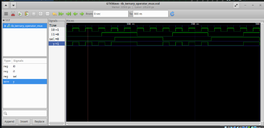

Now we will synthesize the module and generate a netlist and then later proceed with GLS


Now that we have generated the netlist, lets do GLS. so the inputs to the iverilog will be our verilog models, netlist and testbench


Compare the Waveforms. We find it to be same as that we simulated earlier hence the functionality is verified.
I'm just attaching the image of the previous simulation for quick comparison


---
### SKY130RTL D4SK2 L2 Lab GLS Synth Sim Mismatch part2
---

### **Issue: Incorrect Sensitivity List in `bad_mux`**

```verilog
module bad_mux ( 
    input i0, input i1,
    input sel,
    output reg y
);

always @(sel)  // Incorrect sensitivity list
begin
    if (sel)
        y <= i1;
    else
        y <= i0;
end

endmodule
```

#### **What's wrong?**

* The `always` block is triggered **only when `sel` changes**.
* If `i0` or `i1` change but `sel` remains the same, the block **won’t execute**, and `y` will not update.
* This causes simulation to hold the old value of `y`, which is interpreted as **sequential behavior**, not combinational logic.
* Synthesis tools may infer a **latch** or unintended **flip-flop**, depending on the context.

---

### **Correct Version: `good_mux` with Proper Sensitivity List**

```verilog
module good_mux ( 
    input i0, input i1,
    input sel,
    output reg y
);

always @(*)  // Correct sensitivity list
begin
    if (sel)
        y <= i1;
    else
        y <= i0;
end

endmodule
```

#### **Why is this correct?**

* `always @(*)` tells the simulator to **automatically include all inputs** used in the block in the sensitivity list.
* So `i0`, `i1`, and `sel` are all tracked.
* Any change in these signals causes the block to re-evaluate, correctly modeling a **combinational multiplexer**.
* This avoids mismatches between simulation and synthesis.

---

### **Conclusion:**

| Design     | Sensitivity List | Behavior             | Synthesis Result          |
| ---------- | ---------------- | -------------------- | ------------------------- |
| `bad_mux`  | `@(sel)`         | Misses input changes | May infer a latch         |
| `good_mux` | `@(*)`           | Tracks all inputs    | Correct combinational mux |

**Always use `@(*)` for combinational logic** to prevent simulation-synthesis mismatches.

---
### **Simulating, Synthesizing and Gate Level Synthesis of bad_mux and comparing the waveforms**
---


You can see in above waveform that even when sel=0, Y is not following i0.

Synthesizing bad_mux


Now, let's do the Gate level Simulation my giving netlist as input to iverilog along with the verilog models and compare the resulatant waveform with our previous simulation


The GLS shows a proper functionality of an MUX, but still our simulation and GLS are not the same hence we see a Simulation Mismatch.
I'm attaching below our previous simulation so that we can easily see the difference.


---
### **Simulating, Synthesizing and Gate Level Synthesis of good_mux and comparing the waveforms**
---


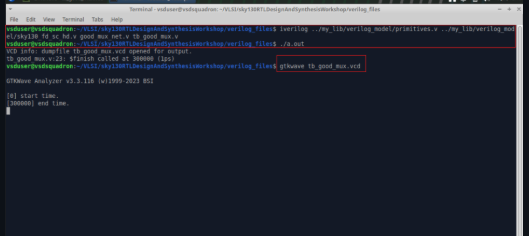


---
## Labs on synth-sim mismatch for blocking statement
---
### SKY130RTL D4SK3 L1 Lab Synth sim mismatch blocking statement part1
and
### SKY130RTL D4SK3 L2 Lab Synth sim mismatch blocking statement part2
---
### **Incorrect Version (Simulation-Synthesis Mismatch)**


```verilog
module blocking_caveat ( 
    input a, b, c,
    output reg d 
);

reg x; 

always @(*)
begin
    d = x & c;   //  Uses old value of x
    x = a | b;   // x is updated *after* d is computed
end

endmodule
```


#### Problem:

* In a **blocking assignment (`=`)**, the operations are executed **in order**, like software instructions.
* Here, `d` is assigned **before** `x` is updated, so it uses the **old or garbage value** of `x`.
* In simulation, this will cause `d` to produce incorrect results.
* In synthesis, the tool might optimize and connect the logic correctly, causing a **mismatch** between simulation and real hardware.

---

### **Correct Version (Proper Combinational Logic)**

```verilog
module blocking_caveat ( 
    input a, b, c,
    output reg d 
);

reg x; 

always @(*)
begin
    x = a | b;   //  Compute x first
    d = x & c;   //  Then use x to compute d
end

endmodule
```

#### Why This is Correct:

* `x` is computed **before** being used in `d`.
* This ensures that `d` always uses the **updated value** of `x`.
* Simulation behavior will **match** synthesis, and the logic will behave as intended.

### Summary Table

| Version     | Order of Assignments       | Behavior                | Synthesis-Simulation Match         |      |
| ----------- | -------------------------- | ----------------------- | -----------------------------------| -----|
|  Incorrect | `d = x & c;`, then \`x = a | b;\`                    | `d` uses stale `x`, behaves wrongly |  No  |
|  Correct   | \`x = a                    | b;`, then `d = x & c;\` | `d` uses fresh `x`, works correctly |  Yes |


Now let's simulate the module blocking_caveat and see if the output is as expected.
---
### Simulation and Synthesis of blocking_caveat followed by GLS**
---


The marked point in the waveform is not following d = (a | b) & c; because x, which is (a | b), is storing old values.

Now, let's do the synthesis, generate our netlist and perform GLS and verify the results


The marked point in the waveform is following d = (a | b) & c

I'm attaching below our previous simulation so that we can easily see the difference.


So we can clearly Synthesis simulation mismatch due to blocking statements.

---
# Day 5 - Optimization in synthesis
---
## If Case constructs
---
### SKY130RTL D5SK1 L1 IF CASE Constructs part1
---


**Caution While Using the `if` Construct:**

In digital design, using the `if` construct carelessly can lead to the inference of unintended latches. This typically happens due to incomplete conditional logic. Consider the following code:

```verilog
if (cond1)
    y = a;
else if (cond2)
    y = b;
```

In this example, there is no `else` clause specifying what should happen when neither `cond1` nor `cond2` is true. As a result, the synthesizer assumes that the value of `y` must be retained in such cases, and to do this, it infers a latch. The latch holds the previous value of `y`, effectively forming a feedback path and creating a combinational loop. Internally, the output of the latch is connected to the multiplexer (MUX) handling `cond2`, and the MUX controlling `cond1` sends its output to one input of the latch. The enable signal for the latch is derived from the logical OR of `cond1` and `cond2`. To avoid such latch inference, always ensure that all possible conditions are covered using a complete `if-else` structure or use a `case` statement when applicable.


---
### Sky130RTL D5SK1 L2 IF CASE Constructs part2
---

Consider the example of a counter:

```verilog
always @ (posedge clk, posedge reset)
begin
    if (reset)
        count <= 3'b00;
    else if (en)
        count <= count + 1;
end
```

Although the code is not complete, it is functionally correct.

Now, let’s analyze the hardware implementation. (It’s always important to visualize the hardware.)

When the `enable` signal is active, the counter increments by 1 (`count + 1`). However, when `enable` is inactive, the counter holds its current value. This is the expected behavior and aligns with how a counter is supposed to function.

It’s important to note that **inferred latches are acceptable in sequential circuits**, where retaining previous state is intentional. However, **in combinational circuits, inferred latches are generally undesirable**, as they can lead to unintended behavior.


**Case Statement:**

* Both `if` and `case` statements are used inside an `always` block and must be assigned to a variable declared as `reg`.
* The `case` statement is typically used for multi-way branching, similar to the `switch-case` construct in C.
* It is well-suited for implementing **multiplexers**, **finite state machines (FSMs)**, and **decoders**.
* All branches of the `case` are evaluated **in parallel**, unlike `if`, which checks conditions sequentially.
* To prevent **unintended latch inference**, it is important to **always include a `default` case**.

Example:

```verilog
always @(sel or c1 or c2)
begin
  case (sel)
    2'b00: out = c1;
    2'b01: out = c2;
    default: out = 1'b0;
  endcase
end
```


To avoid latch inference, we include a `default` case in the `case` statement.

Example:

```verilog
reg [1:0] sel;

always @(*) 
begin
  case (sel)
    2'b00: begin
      out = c1;
    end
    2'b01: begin
      out = c2;
    end
    default: begin
      out = 1'b0;
    end
  endcase
end
```

Including the `default` ensures all possible values of `sel` are covered, thereby avoiding **inferred latches**.

---

### Partial Assignment in `case`:

When controlling multiple outputs within a `case`, **partial assignments** can lead to latch inference.

Example:

```verilog
reg [1:0] sel;
reg x, y;

always @(*)
begin
  case (sel)
    2'b00: begin
      x = a;
      y = b;
    end
    2'b01: begin
      x = c;
      // y is not assigned here
    end
    default: begin
      x = d;
      y = b;
    end
  endcase
end
```

In this example, for `sel = 2'b01`, only `x` is assigned, and `y` is left unassigned in that case. As a result, **`y` retains its previous value**, which causes the synthesis tool to **infer a latch** for `y`.

To avoid this, ensure **all outputs are assigned in every case branch**, including the `default`.


### **Comparison between `if` and `case` statements:**

#### **`if` Statement:**

```verilog
if        // Highest priority
else if
else if
else      // Lowest priority
```

* In the case of `if`, **only one condition is evaluated as true**, based on priority from top to bottom.
* The evaluation follows a **sequential priority order**, and once a true condition is found, the rest are skipped.
* This is ideal when **priority-based decisions** are required.

---

#### **`case` Statement:**

```verilog
case (sel)
  2'b00:
  2'b01:
  2'b10:
  2'b1?:   // '?' indicates a don't care bit (can be 0 or 1)
endcase
```

* In `case`, **all cases are evaluated in parallel**.
* It is essential to **avoid overlapping patterns**, as shown in the bad example above.
* For instance, both `2'b10` and `2'b1?` can match `2'b10`, causing **multiple branches to be valid at once**, which can lead to **unpredictable or incorrect behavior**.
* Therefore, **always ensure non-overlapping conditions** in `case` statements to maintain correctness.
e know if you’d like the same kind of comparison for synthesis results or behavioral use.

---
## Labs on "Incomplete If Case"
---
### Sky130RTL D5SK2 L1 Lab Incomplete IF part1
---
Here’s your content reframed clearly and concisely, without altering the technical meaning:

We will now observe how **synthesis tools** and **simulators** behave when there are **incomplete `if` and `case` statements**.

The necessary files for this demonstration are mentioned below


### **incomp_if**

In this case, the `if` statement gets translated into a **multiplexer (MUX)**.

Here, the **select line** is `i0`.

* When `i0 = 1`, the output `y` is assigned the value `1`.
* However, since the `else` part is missing, when `i0 = 0`, there is **no new assignment**, so the output **retains its previous value** — this results in **latch inference**.

The behavior of this MUX **resembles a D-latch**, with **latch enable** controlled by `i0`.
It acts like a **positive level-sensitive latch**:

* When `i0` is high (`1`), the input (`i1`) is passed to output `y`.
* When `i0` is low (`0`), the output `y` **holds its previous value**, effectively **latching** it.


### Let’s examine the **simulation and synthesis** behavior:

#### **Simulation:**

```bash
iverilog incomp_if.v tb_incomp_if.v
./a.out
gtkwave tb_incomp_if.vcd
```


In the simulation output:

* When `i0` is **high (1)**, the output `y` follows the input `i1`.
* When `i0` is **low (0)**, `y` **latches** onto the last value of `i1` and remains **constant**, even though `i1` might change.

This clearly shows that the absence of an `else` block causes the simulator to treat the output as a **latch**.


---
### Sky130RTL D5SK2 L2 Lab Incomplete IF part2
---
### **incomp_if2.v**


### **Hardware Interpretation: Incomplete `if` Chain**

Looking at the Verilog code in `incomp_if2.v`, the structure uses an incomplete `if-else` chain:

```verilog
if (i0)
    y <= i1;
else if (i2)
    y <= i3;
```

This results in hardware with **two multiplexers**:

1. The **first MUX** selects `i1` when `i0` is high.
2. The **second MUX** selects `i3` when `i2` is high and `i0` is low.
3. However, if **neither `i0` nor `i2` is high**, then `y` is **not assigned any value** — this leads to **latch inference**.

### **D-Latch Behavior:**

* This circuit behaves like a **D-latch**.
* The **enable signal (EN)** for this latch is the logical **OR of `i0` and `i2`**.
* When either `i0` or `i2` is high, one of the assignments to `y` becomes active and data is allowed through.
* When both are low, `y` holds its **previous value**, mimicking **latch behavior**.

### **Input Logic:**

The actual data input to the latch is determined by a combination of the select signals and values:

* If `i0 = 1` → `y = i1`
* Else if `i2 = 1` → `y = i3`
* Else → **no assignment**, so **latch holds**

Thus, the hardware consists of:

* A logic block to evaluate `i0` and `i2` for selection
* A **MUX** structure that picks between `i1` and `i3`
* A **latch** to retain the last value when neither condition is true


We can see whenever i0 = 1--> Output 'y' is following i1.
When i0 = 0 --> it looks towards i2:
When i2 is low --> output is constant
when i2 is high --> output starts following i3


---
## Lab on "Incomplete overlapping case"
---
### Sky130RTL D5SK3 L1 Lab Incomplete overlapping Case part1
---
We will be working on the following files
1) comp_case.v 
2) incomp_case.v 
3) partial_case_assign.v 
4) bad_case.v

## **incomp_case.v**


Based on the Verilog code shown for `incomp_case.v`, we observe the following behavior:

```verilog
case (sel)
  2'b00: y = i0;
  2'b01: y = i1;
endcase
```

* When `sel = 2'b00`, the output `y` is assigned the value of `i0`.
* When `sel = 2'b01`, the output `y` is assigned the value of `i1`.
* However, for `sel = 2'b10` and `2'b11`, **no assignment** is made.
* Moreover, a `default` case is **missing**, which means in those conditions, **`y` retains its previous value**.

### **Inferred Latch:**

Due to incomplete case coverage:

* A **latch is inferred** by the synthesis tool.
* The **enable condition** for this latch is `sel[1]`, because it determines whether or not `y` gets a new value.

### **D-Latch Behavior:**

This circuit effectively behaves like a **D-latch**:

* When `sel[1] = 0` (i.e., `sel` is either `00` or `01`), output `y` directly follows either `i0` or `i1`.
* When `sel[1] = 1` (i.e., `sel` is `10` or `11`), since no assignment is made, `y` **holds its previous value**, which is a classic **latch behavior**.

So the hardware formed here includes:

* A multiplexer selecting between `i0` and `i1` for `sel = 00` or `01`.
* A **latch** that holds `y` when `sel[1] = 1`.


When select is '00' y is following i0,

When select is '01' y is following i1,

The moment select is becoming '11' or '10', y is latching to that value.


---
### Sky130RTL D5SK3 L2 Lab Incomplete overlapping Case part2
---

### **comp_case.v**

**Simulation**


**Synthesis**


---
### Sky130RTL D5SK3 L3 Lab Incomplete overlapping Case part3
---

**partial_case_assign.v**


### **Partial Assignments in Case Statement**

From the code:

```verilog
case(sel)
  2'b00: begin
    y = i0;
    x = i2;
  end

  2'b01: y = i1;

  default: begin
    x = i1;
    y = i2;
  end
endcase
```

### **Key Observations:**

1. **For `sel = 2'b00`**:
   Both `x` and `y` are properly assigned.

2. **For `sel = 2'b01`**:
   Only `y` is assigned. **`x` is left unassigned**, which leads to **latch inference for `x`**.

3. **For all other values of `sel`** (`2'b10` and `2'b11`):
   Both `x` and `y` are assigned in the `default` block — this part is complete.

### **Hardware Implication:**

* Because **`x` is not assigned in the `2'b01` case**, the synthesis tool will infer a **latch for `x`** to hold its value across cycles.
* `y` is fully assigned in all conditions (`00`, `01`, and `default`), so **no latch is inferred for `y`**.


---
### Sky130RTL D5SK3 L4 Lab Incomplete overlapping Case part4
---

### **bad_case.v**


### **Overlapping Patterns in `case`**

In the provided code:

```verilog
case(sel)
  2'b00: y = i0;
  2'b01: y = i1;
  2'b10: y = i2;
  2'b1?: y = i3;  // Overlapping condition
endcase
```
### **Issue: Overlapping Case Conditions**

* The pattern `2'b1?` matches **both** `2'b10` and `2'b11`.
* However, `2'b10` is **already explicitly defined** above.
* This leads to **ambiguous or conflicting assignments** when `sel = 2'b10`.

### **Hardware Behavior:**

* In synthesis, this **overlap creates uncertainty**, since the same input (`sel = 2'b10`) now matches **two different case items**:

  * One maps `y = i2`
  * The other maps `y = i3`
* Depending on tool behavior, this can lead to:

  * **Unpredictable simulation results**
  * **Synthesis mismatches**
  * **Inconsistent RTL to gate-level behavior**

---

**Simulation**


**Synthesis**


**Gate level synthesis**


---
## for loop and for generate
---
### Sky130RTL D5SK4 L1 For Loop and For Generate part1
and
### Sky130RTL D5SK4 L2 For Loop and For Generate part2
---

Let’s now explore two fundamental constructs in Verilog that serve different purposes: the **behavioral `for` loop** and the **structural `generate for` loop**. Though they might look similar, their roles in hardware design and simulation differ significantly.

---

### **Behavioral `for` vs Structural `generate for` in Verilog**

| **Aspect**             | **Behavioral `for` Loop**                              | **Structural `generate for` Loop**                      |
| ---------------------- | ------------------------------------------------------ | ------------------------------------------------------- |
| **Primary Function**   | Used for looping inside `always` blocks                | Used to generate repeated hardware instances            |
| **Typical Usage**      | Suitable for RTL logic and testbenches                 | Ideal for scalable, parameterized hardware generation   |
| **Loop Variable Type** | Declared as `integer`                                  | Must be declared using `genvar`                         |
| **Execution Phase**    | Runs during **simulation**                             | Processes at **compile/elaboration time**               |
| **Location in Code**   | Written within `always` or `initial` blocks            | Placed inside a `generate` block                        |
| **Key Applications**   | Iterating over arrays, writing repetitive test logic   | Replicating modules, designing N-bit buses or registers |
| **Synthesis Support**  | Synthesisable with care (no infinite or dynamic loops) | Fully synthesis-friendly and designed for that purpose  |

---

### **Example: Using `for` Loop in Verilog**

Let’s begin with multiplexer designs of increasing sizes:

#### **2:1 MUX**

```verilog
always @(*) begin
  case (sel)
    1'b0: y = i0;
    1'b1: y = i1;
  endcase
end
```

#### **4:1 MUX**

```verilog
always @(*) begin
  case (sel)
    2'b00: y = i0;
    2'b01: y = i1;
    2'b10: y = i2;
    2'b11: y = i3;
  endcase
end
```

#### **32:1 MUX (Manual Method)**

```verilog
always @(*) begin
  case (sel)
    5'b00000: y = i0;
    5'b00001: y = i1;
    5'b00010: y = i2;
    // ...
    5'b11111: y = i31;
  endcase
end
```

Writing such large case statements becomes tedious and error-prone. That’s where the power of **`for` loops with blocking assignments** comes into play.

---

### **Efficient 32:1 MUX Using `for` Loop**

```verilog
integer i;
always @(*) begin
  for (i = 0; i < 32; i = i + 1) begin
    if (i == sel)
      y = inp[i];
  end
end
```

Here, the blocking assignment (`=`) ensures sequential execution, just like C-style programming. This makes the code compact and scalable for large MUXes or similar repetitive logic.

---

### **1:8 DEMUX Example Using `for` Loop**

Assumptions:

* `ip` is the input signal
* `sel[2:0]` is the select signal
* `op_bus[7:0]` is the output bus

```verilog
integer i;
always @(*) begin
  op_bus = 8'b0;  // Reset all outputs
  for (i = 0; i < 8; i = i + 1) begin
    if (i == sel)
      op_bus[i] = ip;
  end
end
```

This approach ensures that only one output line is activated, matching the selected index.

---

### **Using `generate for` for Hardware Replication**

Suppose you want to instantiate a logic block like an AND gate 500 times. Writing 500 instances manually is infeasible. Instead, **`generate for` loops** are designed for this.

Here’s an example with 8 replicated AND gates:

```verilog
genvar i;
generate
  for (i = 0; i < 8; i = i + 1) begin : and_loop
    and u_and (.a(in1[i]), .b(in2[i]), .y(y[i]));
  end
endgenerate
```

* `genvar` declares the loop variable for compile-time generation.
* `generate` and `endgenerate` define the scope of hardware replication.
* `begin : and_loop` gives a unique name to the block for synthesis and debugging.

---
### Sky130RTL D5SK4 L3 For Loop and For Generate part3
---
manually replicating hardware like full adders in a 32-bit Ripple Carry Adder (RCA) is inefficient, error-prone, and not scalable. That’s where Verilog's generate and for constructs come in.

### Why Replication (Generate Loop) is Needed in Hardware Design:

1. **Scalability**
   Instead of writing repetitive code for each bit, you can describe the logic once and replicate it automatically.

2. **Maintainability**
   Changing the adder from 32-bit to 64-bit becomes a one-line change, not a complete rewrite.

3. **Synthesis Tool Optimization**
   The synthesizer treats the replicated blocks as individual hardware units anyway, so using `generate` doesn’t hinder synthesis — it just makes your code more elegant.

4. **Avoids Errors**
   Manual instantiations can introduce copy-paste bugs. `generate` ensures each instance is correctly indexed.

---


### Example: 32-bit RCA Using Generate in Verilog

```verilog
module ripple_carry_adder #(parameter N = 32) (
    input [N-1:0] A, B,
    input cin,
    output [N-1:0] Sum,
    output cout
);
    wire [N:0] carry;
    assign carry[0] = cin;

    genvar i;
    generate
        for (i = 0; i < N; i = i + 1) begin : RCA_LOOP
            full_adder FA (
                .a(A[i]),
                .b(B[i]),
                .cin(carry[i]),
                .sum(Sum[i]),
                .cout(carry[i+1])
            );
        end
    endgenerate

    assign cout = carry[N];

endmodule
```

In this example, the loop automatically instantiates `N` full adders — one for each bit — all connected in ripple fashion.

---

### Conclusion

Using generate loops:

* Reduces code size
* Prevents bugs
* Makes your design portable and flexible

This approach aligns with modern digital design best practices.

---
## Labs on "for loop" and "for generate"
---
### Sky130RTL D5SK5 L1 Lab For and For Generate part1
---

### **mux_generate.v**


This Verilog module implements a **4:1 multiplexer** using a `for` loop within a combinational logic block. A multiplexer selects one of several input signals and forwards it to the output, based on the value of a select signal.

### 1. **Module Declaration**

```verilog
module mux_generate (
    input i0, input i1, input i2, input i3,
    input [1:0] sel,
    output reg y
);
```

* **Inputs:**

  * `i0`, `i1`, `i2`, `i3` — four 1-bit input signals.
  * `sel` — a 2-bit control signal used to select one of the inputs.

* **Output:**

  * `y` — the selected input is passed to this output.

---

### 2. **Input Vector Construction**

```verilog
wire [3:0] i_int;
assign i_int = {i3, i2, i1, i0};
```

* This line groups the 4 inputs into a 4-bit vector `i_int` for easier indexing.
* `{i3, i2, i1, i0}` forms the vector in descending priority:

  * `i_int[3] = i3`, `i_int[0] = i0`.

---

### **For Loop for Multiplexing Logic**

```verilog
integer k;

always @(*)
begin
    for (k = 0; k < 4; k = k + 1) begin
        if (k == sel)
            y = i_int[k];
    end
end
```

* `integer k;` — loop index variable.
* `always @(*)` — this block will execute whenever any of its inputs change (combinational logic).
* `for` loop — iterates over all possible input indices (0 to 3).
* `if (k == sel)` — compares loop index `k` with the value of the `sel` input.
* `y = i_int[k];` — if a match is found, assigns the corresponding input to output `y`.

* If `sel = 2'b00`, then `y = i0`
* If `sel = 2'b01`, then `y = i1`
* If `sel = 2'b10`, then `y = i2`
* If `sel = 2'b11`, then `y = i3`

This behaves exactly like a 4:1 multiplexer.

* The loop dynamically selects the input based on `sel` value.
* `always @(*)` ensures combinational behavior (no latches).
* `reg y;` is correctly used since the assignment is done inside an `always` block.

---


We observe that:

* For select line `00`, output `y = i0`
* For `01`, `y = i1`
* For `10`, `y = i2`
* For `11`, `y = i3`

This mapping confirms correct multiplexer behavior. Using this structure is essential when scaling up to larger multiplexers (e.g., 8:1, 16:1, 32:1), as it avoids repetitive manual instantiation and allows parameterized design using loops or generate blocks.


